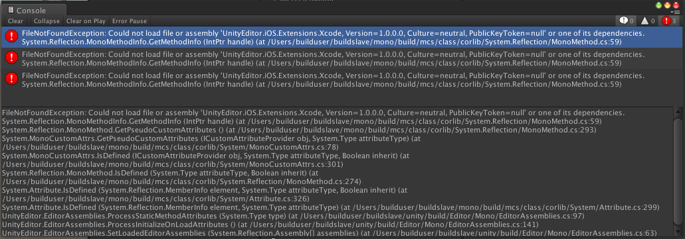
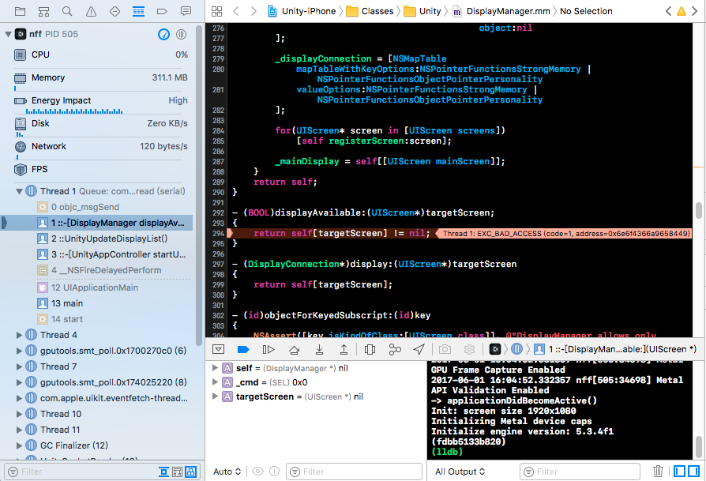

# Contents

[0.Summary](Build.md#0summary) -> 概述

[1.Build Setting](Build.md#1buildsetting)

[2.Android Build](Build.md#2android-build)  -> 打包Android(生成apk文件)

[3.iOS Build](Build.md#3ios-build) -> 打包iOS（先导出iOS文件后，用Xcode生成ipa文件） 

[3.1.Export Xcode Project](Build.md#31export-xcode-project) -> 导出Xcode工程

[9.FAQ](Build.md#9faq)

--------------------------------

## 0.Summary
[返回目录](./build.md#contents)

本打包系统，支持第三方CI工具（此次使用的TeamCity）。也就是支持命令行打包。

--------------------------------

### 1.Build Setting
[返回目录](./build.md#contents)

--------------------------------

### 2.Android Build
[返回目录](./build.md#contents)

--------------------------------

### 3.iOS Build
[返回目录](./build.md#contents)

#### 3.1.Export Xcode Project

--------------------------------

### 9.FAQ
[返回目录](./build.md#contents)

### 9.1 UnityEditor.iOS.Extensions.Xcode丢失错误

| 图：9-1-1     | 
|:-------------:|
||

`详细错误：`
<pre><code>
FileNotFoundException: Could not load file or assembly 'UnityEditor.iOS.Extensions.Xcode, Version=1.0.0.0, Culture=neutral, PublicKeyToken=null' or one of its dependencies.

System.Reflection.MonoMethodInfo.GetMethodInfo (IntPtr handle) (at /Users/builduser/buildslave/mono/build/mcs/class/corlib/System.Reflection/MonoMethod.cs:59)

System.Reflection.MonoMethod.GetPseudoCustomAttributes () (at /Users/builduser/buildslave/mono/build/mcs/class/corlib/System.Reflection/MonoMethod.cs:293)

System.MonoCustomAttrs.GetPseudoCustomAttributes (ICustomAttributeProvider obj, System.Type attributeType) (at /Users/builduser/buildslave/mono/build/mcs/class/corlib/System/MonoCustomAttrs.cs:78)

System.MonoCustomAttrs.IsDefined (ICustomAttributeProvider obj, System.Type attributeType, Boolean inherit) (at /Users/builduser/buildslave/mono/build/mcs/class/corlib/System/MonoCustomAttrs.cs:301)

System.Reflection.MonoMethod.IsDefined (System.Type attributeType, Boolean inherit) (at /Users/builduser/buildslave/mono/build/mcs/class/corlib/System.Reflection/MonoMethod.cs:274)

System.Attribute.IsDefined (System.Reflection.MemberInfo element, System.Type attributeType, Boolean inherit) (at /Users/builduser/buildslave/mono/build/mcs/class/corlib/System/Attribute.cs:326)

System.Attribute.IsDefined (System.Reflection.MemberInfo element, System.Type attributeType) (at /Users/builduser/buildslave/mono/build/mcs/class/corlib/System/Attribute.cs:299)

UnityEditor.EditorAssemblies.ProcessStaticMethodAttributes (System.Type type) (at /Users/builduser/buildslave/unity/build/Editor/Mono/EditorAssemblies.cs:97)

UnityEditor.EditorAssemblies.ProcessInitializeOnLoadAttributes () (at /Users/builduser/buildslave/unity/build/Editor/Mono/EditorAssemblies.cs:141)

UnityEditor.EditorAssemblies.SetLoadedEditorAssemblies (System.Reflection.Assembly[] assemblies) (at /Users/builduser/buildslave/unity/build/Editor/Mono/EditorAssemblies.cs:63)

</code></pre>

`原因：`

    不明。已经确认的时，UnityEditor.iOS.Extensions.Xcode相关库只能在一个方法中使用。（如：PBXProject）。

`解决方法：`

    1） 若是启动Unity工程一直出现这个错误，则关闭Unity -> 删除工程目录下Library文件夹 ->重新打开Unity
    
    2） 代码写法上，把所有处理集中在一个方法内完成。
    
    3）备注：这Bug据说在V5.6以后被官方修正了。

#### 9.2 Build crashes on displayAvailable in xcode

使用了UnityEditor.iOS.Extensions.Xcode中PBXProject后，设置导出了XCode文件，真机测试时，会出现以下的崩溃。

| 图：9-2-1     | 
|:-------------:|
||

`原因：`

    不明。据说是Unity3d本身的Bug。建议升级到v5.6。

`解决方法：`

    按下列方式修改以下代码
    
    `文件：`DisplayManager.mm
    

* 修改前

<pre><code>
_displayConnection = [NSMapTable
    mapTableWithKeyOptions:NSPointerFunctionsStrongMemory | NSPointerFunctionsObjectPointerPersonality
    valueOptions:NSPointerFunctionsStrongMemory | NSPointerFunctionsObjectPointerPersonality
    ];
</pre></code>

* 修改后

<pre><code>
_displayConnection = `[`[NSMapTable
    mapTableWithKeyOptions:NSPointerFunctionsStrongMemory | NSPointerFunctionsObjectPointerPersonality
    valueOptions:NSPointerFunctionsStrongMemory | NSPointerFunctionsObjectPointerPersonality
    ] `retain]`;
</pre></code>

`备注：`

    参考URL：[网上相关类似错误说明](https://stackoverflow.com/questions/33972747/build-crashes-on-displayavailable-in-xcode)

--------------------------------
