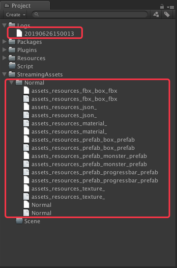
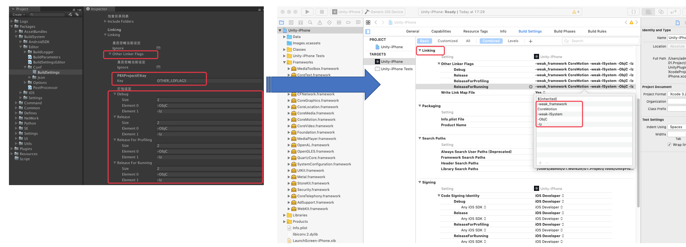
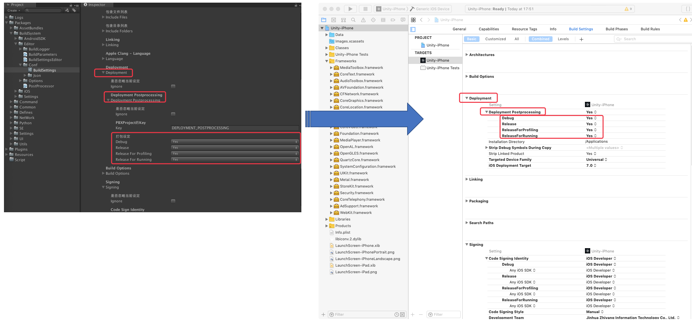

# 目录
[返回主目录](./README.md#3%E6%89%93%E5%8C%85%E7%B3%BB%E7%BB%9F)

--------------------------------

#### [3.打包系统](./BuildSystem.md#3%E6%89%93%E5%8C%85%E7%B3%BB%E7%BB%9F-1)

##### [3.1.命令行参数](./BuildSystem.md#31%E5%91%BD%E4%BB%A4%E8%A1%8C%E5%8F%82%E6%95%B0-1)

###### [3.1.1.Apk/Ipa导出文件命名](./BuildSystem.md#311apkipa%E5%AF%BC%E5%87%BA%E6%96%87%E4%BB%B6%E5%91%BD%E5%90%8D-1)

##### [3.2.宏定义](./BuildSystem.md#32%E5%AE%8F%E5%AE%9A%E4%B9%89-1)

##### [3.3.AB打包](./BuildSystem.md#33ab%E6%89%93%E5%8C%85-1)

##### [3.4.Apk打包](./BuildSystem.md#34apk%E6%89%93%E5%8C%85-1)

##### [3.5.Ipa打包](./BuildSystem.md#35ipa%E6%89%93%E5%8C%85-1)

###### [3.5.1.Xcode设定](./BuildSystem.md#351xcode%E8%AE%BE%E5%AE%9A-1)

###### [3.5.1.1.Replace Targets](./BuildSystem.md#3511replace-targets-1)

###### [3.5.1.2.FrameWorks](./BuildSystem.md#3512frameworks-1)

###### [3.5.1.3.Libraries](./BuildSystem.md#3513libraries-1)

###### [3.5.1.4.Include Files](./BuildSystem.md#3514include-files-1)

###### [3.5.1.5.Include Folders](./BuildSystem.md#3515include-folders-1)

###### [3.5.1.6.Linking](./BuildSystem.md#3516linking-1)

###### [3.5.1.7.Language](./BuildSystem.md#3517language-1)

###### [3.5.1.8.Deployment](./BuildSystem.md#3518deployment-1)

###### [3.5.1.9.Build Options](./BuildSystem.md#3519build-options-1)

###### [3.5.1.10.Signing](./BuildSystem.md#35110signing-1)

###### [3.5.1.11.User Defined](./BuildSystem.md#35111user-defined-1)

###### [3.5.1.12.Other Setting](./BuildSystem.md#35112other-setting-1)

--------------------------------

## 3.打包系统
[返回目录](./BuildSystem.md#%E7%9B%AE%E5%BD%95)

打包系统包含如下：

* 打包日志
* [3.1.命令行参数](./BuildSystem.md#31%E5%91%BD%E4%BB%A4%E8%A1%8C%E5%8F%82%E6%95%B0)
* [3.2.宏定义](./BuildSystem.md#32%E5%AE%8F%E5%AE%9A%E4%B9%89-1)
* [3.3.AB打包](./BuildSystem.md#33ab%E6%89%93%E5%8C%85-1)
* [3.4.Apk打包](./BuildSystem.md#34apk%E6%89%93%E5%8C%85-1)
* [3.5.Ipa打包](./BuildSystem.md#35ipa%E6%89%93%E5%8C%85-1)


* 打包日志

输出目录

1. 命令行参数未指定的场合：=> `Assets/Logs`
2. 命令行参数指定的场合：=> 指定目录。详细参看：[3.1.命令行参数](./BuildSystem.md#31%E5%91%BD%E4%BB%A4%E8%A1%8C%E5%8F%82%E6%95%B0)

### 3.1.命令行参数
[返回目录](./BuildSystem.md#%E7%9B%AE%E5%BD%95)

| 参数名 | 格式 | 类型 | 说明 | 备注  |
| :-- | :-- | :-- | :-- | :-- |
| OutputDir | -output [输出目录] | string | 输出目录 | 默认目录：`Output` |
| ProjectName | -projectName [工程名称] | string | 工程名称 | 若不指定默认值为`系统设定`的`BuildName`。详细参看:[2.2.2.一般](./SysSettings.md#222%E4%B8%80%E8%88%AC-1)。若指定会重置系统设定中相应的`BuildName`。<BR/>此外， Apk/Ipa的打包成功后，导出的文件`开头`会以此`项目名称`开头。<BR/>导出文件命名详细参看:[3.1.1.Apk/Ipa导出文件命名](./BuildSystem.md#311apkipa%E5%AF%BC%E5%87%BA%E6%96%87%E4%BB%B6%E5%91%BD%E5%90%8D-1) | 
| GameName | -gameName [游戏名] | string | 游戏名 | App安装成功后，在手机中显示的名字。<BR/> 命令行若不指定，默认值为：`ProjectName` |
| BuildId | -buildId [打包ID] | string | 打包ID | 若不指定默认值为`系统设定`的`BuildId`。详细参看:[2.2.2.一般](./SysSettings.md#222%E4%B8%80%E8%88%AC-1)。若指定会重置系统设定中相应的`BuildId`。| 
| BuildVersion | -buildVersion [版本号] | string | 版本号 | 若不指定默认值为`系统设定`的`BuildVersion`。详细参看:[2.2.2.一般](./SysSettings.md#222%E4%B8%80%E8%88%AC-1)。若指定会重置系统设定中相应的`BuildVersion`。| 
| BuildVersionCode | -buildVersionCode [打包码] | int | 打包码 | 该打包码是从项目发布开始，从1开始标号的统一连续数字采番。一般为内部统一标识别号。<BR/>详细参看:[2.2.2.一般](./SysSettings.md#222%E4%B8%80%E8%88%AC-1)的`BuildVersionCode`。 |
| LogLevel | -logLevel [Log等级] | int | Log等级 | 若不指定默认值为`系统设定`的`LogLevel`。详细参看:[2.2.2.一般](./SysSettings.md#222%E4%B8%80%E8%88%AC-1)。若指定会重置系统设定中相应的`LogLevel`。 | 
| PlatformType | -Huawei/-Tiange | - | 平台类型 | 平台类型分为:<BR/> * iOS : 打包`iOS`时自动设定，`无需额外指定`。<BR/> * Android : 打包`安卓`时自动设定，`无需额外指定`。<BR/> * Huawei<BR/> * Tiange <BR/> 详细参看:[2.2.2.一般](./SysSettings.md#222%E4%B8%80%E8%88%AC-1)。若指定会重置系统设定中相应的`PlatformType`。 | 
| BuildNumber | -buildNo [打包No] | int | 打包No | TeamCity/Jenkins流水线的打包序号。<BR/> 详细参看:[2.2.2.一般](./SysSettings.md#222%E4%B8%80%E8%88%AC-1)。若指定会重置系统设定中相应的`ResourceNo`和`TempInfo:BuildNumber`。 | 
| Fps | -FPS [帧数] | int | 帧数 | 各个项目需要根据该参数，`自行设定`相关参数的设定。 |
| BuildMode | -debug/-release/-production | - | 打包模式 | 打包模式包括: <BR/> * Debug : 多为开发时用。 <BR/> * Release : 多为测试时使用。<BR/> * Production : 多为发布时使用。<BR/>若不指定默认值为`系统设定`的`BuildMode`。详细参看:[2.2.2.一般](./SysSettings.md#222%E4%B8%80%E8%88%AC-1)。若指定会重置系统设定中相应的`BuildMode`。 |
| Defines | -defines [宏定义列表] | 字符串数组 | 宏定义列表 | 备注:<BR/> * 分隔符:`,`<BR/> * 宏定义推荐用大写字母。<BR/> 如：MACRO1,MACRO2 |
| CiMode | -teamCity/-jenkins | string | ci模式 | 该定义只是在系统打包时，做内部区分用。目前意义只在于区分打包日志。 |
| IsCheatMode | -cheat | - | 作弊模式/GM模式 | 该模式下，可支持GM 命令。<BR/> `需要内部系统支持。` |
| IsSkipDownload | -skipDownload | - | 跳过下载 | 该设定仅用于开发模式下，且无需要下载/热更资源的场合。 |
| BuildTime | -buildTime [打包时间] | string | 打包时的系统时间 | 格式:`YYYYMMDDHHMMSS`。 |
| WebHost | -webHost [前端Web Host] | string | 前端Web Host地址 | 该地址可用于，拉取服务器列表，服务器公告，服务器推送等 |
| WebPortNo | -webPortNo [前端Web Port No] | int | 前端端口号 | 同上 |
| BuildLogFile | -buildLogFile [Log文件] | string | Log文件 | - |

`命令行示例`:

```
$PRO_UNITY_PATH -projectPath [工程目录] -executeMethod Packages.Defines.Editor.DefinesSetting.AddAndroidDefines -debug -defines LOCALIZATION_CN -batchmode -quit
```

* `$PRO_UNITY_PATH` : Unity3d的安装路径
* `-projectPath [工程目录]` : 指定工程路径
* `-executeMethod` Packages.Defines.Editor.DefinesSetting.AddAndroidDefines :  : 指定命令行接口。此处即为`CMD`。该`CMD`也是[2.2.2.一般](./SysSettings.md#222%E4%B8%80%E8%88%AC-1)时提到的`CMD`。之后的命令行参数信息可参看:[3.1.命令行参数](./BuildSystem.md#31%E5%91%BD%E4%BB%A4%E8%A1%8C%E5%8F%82%E6%95%B0-1)。
* `-debug` : 打包模式为:`Debug`。 
* `-batchmode` : 后台运行 
* `-quit` : 运行完自动退出

#### 3.1.1.Apk/Ipa导出文件命名
[返回目录](./BuildSystem.md#%E7%9B%AE%E5%BD%95)

`命名规则`

```
 [工程名称]_[打包模式]_v[版本号]_[打包No]_[打包时间戳]_[打包ID].apk/ipa
```

例如：

> UnityPlugins_Debug_v1.0.0_-_20190625104301_com.zy.nff.apk

| 名称 | 说明 | 备注  |
| :-- | :-- | :-- |
| 工程名称 | 工程名称 | 命令行参数<BR> 未指定:系统设定的`BuildName`。详情可参看:[2.2.2.一般](./SysSettings.md#222%E4%B8%80%E8%88%AC-1)的`BuildName`。<BR/>指定:则外部指定的工程名。同时还会`重置`系统设定的`BuildName`。详情可参看:[3.1.命令行参数](./BuildSystem.md#31%E5%91%BD%E4%BB%A4%E8%A1%8C%E5%8F%82%E6%95%B0)的`ProjectName` |
| 打包模式 | 打包模式 | Apk/Ipa的打包模式。<BR/>包含:<BR/> * Debug<BR/> * Release<BR/> * Production <BR/>命令行参数<BR> 未指定:系统设定的`BuildMode`。详情可参看:[2.2.2.一般](./SysSettings.md#222%E4%B8%80%E8%88%AC-1)的`BuildMode`。<BR/>指定:则外部指定的工程名。同时还会`重置`系统设定的`BuildName`。详情可参看:[3.1.命令行参数](./BuildSystem.md#31%E5%91%BD%E4%BB%A4%E8%A1%8C%E5%8F%82%E6%95%B0)的`BuildMode` |
| 版本号 | 打包用的版本号 | 命令行参数<BR> 未指定:系统设定的`BuildVersion`。详情可参看:[2.2.2.一般](./SysSettings.md#222%E4%B8%80%E8%88%AC-1)的`BuildVersion`。<BR/>指定:则外部指定的工程名。同时还会`重置`系统设定的`BuildVersion`。详情可参看:[3.1.命令行参数](./BuildSystem.md#31%E5%91%BD%E4%BB%A4%E8%A1%8C%E5%8F%82%E6%95%B0)的`BuildVersion` |
| 打包No | TeamCity/Jenkins打包时，打包流水线的序号。 | 命令行参数<BR> 未指定:-1(固定)。详情可参看:[2.2.2.一般](./SysSettings.md#222%E4%B8%80%E8%88%AC-1)的`BuildMode`。<BR/>指定:则外部指定的工程名。同时还会`重置`系统设定的`BuildVersion`。详情可参看:[3.1.命令行参数](./BuildSystem.md#31%E5%91%BD%E4%BB%A4%E8%A1%8C%E5%8F%82%E6%95%B0)的`ResourceNo`和`TempInfo:BuildNumber` |
| 打包时间戳 | 打包时的系统时间。 | 格式：`YYYYMMDDHHMMSS` |
| 打包ID | 打包ID | 命令行参数<BR> 未指定:系统设定的`BuildId`。详情可参看:[2.2.2.一般](./SysSettings.md#222%E4%B8%80%E8%88%AC-1)的`BuildId`。<BR/>指定:则外部指定的工程名。同时还会`重置`系统设定的`BuildId`。详情可参看:[3.1.命令行参数](./BuildSystem.md#31%E5%91%BD%E4%BB%A4%E8%A1%8C%E5%8F%82%E6%95%B0)的`BuildId` |


### 3.2.宏定义
[返回目录](./BuildSystem.md#%E7%9B%AE%E5%BD%95)

操作流程可分`手动追加`和`命令行追加`。

1. `手动追加`

宏定义可以通过自定义窗口手动添加。如`图3-2-1`。

菜单：

```
Tools > Defines
```

| `图3-2-1` 宏定义窗口 |
| :---: |
|  |

`注意`：
* 追加好想用的宏之后，必须点击`Apply`按钮，应用之后才会有效。


2. `命令行追加`

* `命令行示例`:

```
$PRO_UNITY_PATH -projectPath [工程目录] -executeMethod Packages.Defines.Editor.DefinesSetting.AddAndroidDefines -debug -defines MACRO1,MACRO2 -batchmode -quit
```

`注意`：
* 在命令行打包时，必须分别执行宏定义命令后才能执行相应的打包命令。不能在同一次执行中同时执行。

### 3.3.AB打包
[返回目录](./BuildSystem.md#%E7%9B%AE%E5%BD%95)

1. 设定

打包可以通过以下方式进行打包文件的设定。如`图3-3-1`。

```
Bundles > Config > Resources > OneDir 
```

| `图3-3-1` AB打包菜单 |
| :---: |
|  |

`添加的类型`可以参看下表

| 类型 | 说明 | 备注 |
| :-- | :-- | :-- |
| OneDir | 单目录打包 | 指定的单个目录，作为一个个体，进行AB包打包。 |
| FieOneToOne | 单个文件打包 | 指定的单个目录中，所有文件分别作为一个个体，进行打包。 |
| TopDirOneToOne | 子目录打包 | 指定的目录下，所有子目录分别作为一个个体，进行打包。 |
| SceneOneToOne | 场景打包 | 指定的场景文件，作为一个个体，进行打包。 |

2. 忽略列表

除此之外，也可以由上述菜单，设置忽略文件。这样在实际打包时就会排除指定的文件在进行打包。

| `图3-3-2` 忽略文件 |
| :---: |
|  |

* `添加忽略`

```
Bundles > Config > Resources > Ignore > Ignore 
```

* `移除忽略`

```
Bundles > Config > Resources > Ignore > Remove 
```

* `清空忽略`

```
Bundles > Config > Resources > Ignore > Clear 
```

经过上述操作，打包设定信息结果如`图3-3-3` 打包设定信息

| `图3-3-3` 打包设定信息 |
| :---: |
|  |

3. 运行

运行方式有两种。`菜单运行`和`命令行运行`。

* `菜单运行`

该种方式多用于本地打包。如：开发中进行特定调试等。

```
AssetBundles > Build > IOS/Android 
```

`注意`:

Unity3d规定:iOS/Android必须分别打包。

| `图3-3-4` 打包菜单 |
| :---: |
|  |

* `命令行运行`

该种方式多用于CI工具链打包。如：`TeamCity`，`Jenkins`等。

```
$PRO_UNITY_PATH -projectPath [工程目录] -executeMethod Packages.Command.Editor.AssetBundlesBuild.BuildForAndroid -output [输出目录] -batchmode -jenkins -quit 
```

* `$PRO_UNITY_PATH` : Unity3d的安装路径
* `-projectPath [工程目录]` : 指定工程路径
* -executeMethod `Packages.Command.Editor.AssetBundlesBuild.BuildForAndroid` : 指定命令行接口。此处即为`CMD`。该`CMD`也是[2.2.2.一般](./SysSettings.md#222%E4%B8%80%E8%88%AC-1)时提到的`CMD`。之后的命令行参数信息可参看:[3.1.命令行参数](./BuildSystem.md#31%E5%91%BD%E4%BB%A4%E8%A1%8C%E5%8F%82%E6%95%B0-1)。
* `-jenkins` : CiMOde为Jenkins。即是在Jenkins的流水线上进行打包的。 
* `-batchmode` : 后台运行 
* `-quit` : 运行完自动退出

4. 结果

经过上述两种方式就可以根据指定好的设定信息进行打包。打包结果如`图3-3-5` 打包结果。

| `图3-3-5` 打包结果 |
| :---: |
|  |

`注意`:

由于当前系统种资源检索ID的唯一标示，只是简单的`路径`+`文件名`的形式。
而在加载指定文件名时，若存在`两个AB包`中同时存在`同名文件`时。
会优先选择找到的第一个文件进行加载。所以强烈建议所有`文件名命名保持全局唯一`。

该问题将在后续版本中探讨解决。

### 3.4.Apk打包
[返回目录](./BuildSystem.md#%E7%9B%AE%E5%BD%95)

打包流程如下图：


流程说明如下表：

| 序号 | 内容 | 说明 | 备注 |
| :--: | :-- | :-- | :-- |
| 0 | 开始 | - | - |
| 1 | 命令行参数设置 | 可以根据实际需要，利用命令行指定运行参数。 | 详情参看:[3.1.命令行参数](./BuildSystem.md#31%E5%91%BD%E4%BB%A4%E8%A1%8C%E5%8F%82%E6%95%B0-1) |
| 2 | 是否为纯Android? | 不涉及到任何发布平台 | 在实际App发布时往往会根据实际的发布平台进行一些针对性的设定。<BR/>特别是在Android发布平台。<BR/> 如：小米，华为等等 |
| 3 | 是否为华为？| 是否为华为平台? | - |
| 4 | 导入华为设定信息 | 详细可参看:[3.4.1.1.设定](./BuildSystem.md#3411%E8%AE%BE%E5%AE%9A-1)中的华为 。 | 在这里强烈推荐自定义导出(*.aar)包导出工程。详细参看:[UToASDKHuawei](http://192.168.101.38:9091/tools/UToASDKHuawei) |
| 5 | 选项设置：华为 | 详细可参看:[3.4.1.2.扩展](./BuildSystem.md#3412%E6%89%A9%E5%B1%95-1) | - |
| 6 | 是否为天鸽？| 是否为华为天鸽? | 天鸽本身严格意义上不算平台，算运营商。采用的是天鸽一些自己的设置（如：账号什么的）+ 第三方SDK（如：`易接SDK`）。 <BR/>但是在实际接入的时候，又不得不考虑它的特殊性。所以就单独定义了此种类型的平台。方便以后扩展。<BR/> 同样的我们也专门的自定义了一个专属的(*.aar)包导出工程。详情参看:[UToASDKOneSDK](http://192.168.101.38:9091/tools/UToASDKOneSDK) |
| 7 | 导入天鸽设定信息 | 同华为 | - |
| 8 | 选项设置：天鸽 | 同华为 | - |
| 9 | 清空Plugins文件夹 | 清空目录(`Assets/Plugins/Android`)及其子目录。 | 为了每次Android打包时，`Plugins`目录的干净，每次打包的时候都会清空一次。 |
| 10 | 重置Plugins文件夹 | 重置目录(`Assets/Plugins/Android`)及其子目录 | Android打包时，根据平台的不同，会从相应的目录下，拷贝Pligins所需的库，资源以及其他设定信息。<BR/> 详情参看：`图3-4-1` Plugins重置 |
| 11 | 华为？ | - | - |
| 12 | 合并华为AndroidManifest.xml | 合并华为专用的AndroidManifest.xml到当前工程中。 | 华为平台发布，规定了一些属性，必须写入相应的AndroidManifest.xml。<BR/> 在(*.aar)包导出工程会一步式导出华为所有设置到指定目录。<BR/>详细参看:[UToASDKHuawei](http://192.168.101.38:9091/tools/UToASDKHuawei) |
| 13 | 拷贝库华为资源 | 拷贝相应的库文件，资源文件等 | - |
| 14 | 天鸽？ | - | - |
| 15 | 合并天鸽AndroidManifest.xml | 同华为 | - |
| 16 | 拷贝库天鸽资源 | 同华为 | - |
| 17 | 输出打包信息 | 输出打包信息 | 会向指定临时文件中输出工程名，版本，打包时的系统时间等信息。<BR/>该信息现在尽在iOS打包时使用。Android下时保留信息。 |
| 18 | Android Build | Android打包 | - |
| 19 | 生成上传脚本 | 自动生成向远程服务器上传用的Shell脚本 | 上传服务器信息可参看:[2.2.4.网络](./SysSettings.md#224%E7%BD%91%E7%BB%9C-1)的`Resource Server` |
| 20 | 生成CDN刷新脚本 | 自动生成CDN服务器刷新用Shell脚本 | 刷新用的CDN服务器信息可参看:[2.2.4.网络](./SysSettings.md#224%E7%BD%91%E7%BB%9C-1)的`Cdn Server`。<BR/>Cdn服务器相关的设定内容需咨询公司网管。 |

* Plugins相关目录

| `图3-4-1` Plugins重置 |
| :---: |
|  |

| 序号 | 名称 | 说明 | 备注 |
| :--: | :-- | :-- | :-- |
| 1 | AndroidPlatform | 安卓平台目录 | 相关平台设置可以参看:[2.2.2.一般](./SysSettings.md#222%E4%B8%80%E8%88%AC-1)中的`BuildMode`。<BR/>也可以在命令行参数中指定。详情参看:[3.1.命令行参数](./BuildSystem.md#31%E5%91%BD%E4%BB%A4%E8%A1%8C%E5%8F%82%E6%95%B0-1)的`BuildMode`。 <BR/> 命令行参数设置优先级`高于`系统设置指定，并会`重置`系统设定。 |
| 2 | Huawei | 平台文件夹：华为  | - |
| 3 | 华为SDK接入包(*.aar) | - | 该`*.aar`包导出，详细参看:[UToASDKHuawei](http://192.168.101.38:9091/tools/UToASDKHuawei)  |
| 4 | xml设定文件 | `res/value`目录下相关的xml文件 | 详细内容可以参看:[UToASDKHuawei](http://192.168.101.38:9091/tools/UToASDKHuawei)设定或相关平台SDK接入说明文档。 |

### 3.5.Ipa打包
[返回目录](./BuildSystem.md#%E7%9B%AE%E5%BD%95)

针对iOS的打包(*.ipa),在`Unity3d`下有相关设定。大体如`图 3-5-1` iOS导出设定。

| `图 3-5-1` iOS导出设定 |
| :---: |
|  |

* 该打包设定文件路径为: Assets/Packages/BuildSystem/Editor/Conf/`BuildSettings.asset`
* 该文件中的大部分标题提示与实际导出的XCode工程中的设定一致。详细可参看下表：

| 属性名 | 是否为<BR/>XCode中的属性 | 说明 | 备注 | 
| :-- | :--: | :-- | :-- |
| Ignore | 否 | 是否忽略该设定，在导出的XCode工程中，<BR/>当前属性不设定。 | 各个父属性以及其子属性都有该选项。作用相同。 |
| XcodeSchema | 否 | 该名字虽然不是导出的XCode工程中的属性，<BR/>却也与`Xcode工程有关`。 | 1) 一般该名字在Unity导出的XCode工程中为:`Unity-iPhone`。 <BR/> 2) 该属性也与Jenkins中Xcode打包命令`xcodeBuild`的参数`xcodeSchema`一致。 <BR/> 3) 在以后的版本在考虑是否需要更改。<BR/> 4) 详情参看：`图 3-5-2` XcodeSchema |
| Replace Targets | 否 | 若有OC/C/C++的源码需要替换或者同步导入<BR/>XCode工程中的话，可以在这里追加相应的源码路径。<BR/> `当前工作目录`:Application.dataPath | 详情参看:[3.5.1.1.Replace Targets](./BuildSystem.md#3511replace-targets-1) |   
| FrameWorks | 否 | 框架文件列表<BR/>（不知道怎么翻译好，先这么叫吧） <BR/> 若有需要预先设定的`*.framework`文件，<BR/>可以添加进该列表。| 详情参看:[3.5.1.2.FrameWorks](./BuildSystem.md#3512frameworks-1) | 
| Libraries | 否 | 库文件列表 | 若有相应的库文件(*.dll)需追加，<BR/> 可以在此添加进列表。 | 详情参看:[3.5.1.3.Libraries](./BuildSystem.md#3513libraries-1) |
| Include Files | 否 | 若有需要同步导入XCode工程的相应文件，<BR/>其中可包含所有类型的文件。| 详情参看:[3.5.1.4.Include Files](./BuildSystem.md#3514include-files-1) |
| Include Folders | 否 | 同`Include Files`。<BR/> 不同的是可以以文件夹为单位。 | 详情参看:[3.5.1.5.Include Folders](./BuildSystem.md#3515include-folders-1) |
| Linking | `是` | XCode工程中`Linking`的相关设定。 | 详情参看:[3.5.1.6.Linking](./BuildSystem.md#3516linking-1)<BR/>如`图 3-5-3` Linking |
| Language | `是` | XCode工程中`Language`的相关设定。| 详情参看:[3.5.1.7.Language](./BuildSystem.md#3517language-1)<BR/>可以像`Linking`一样在Xcode中找到相应的设定。 |
| Deployment | `是` | XCode工程中`Deployment`的相关设定。| 详情参看:[3.5.1.8.Deployment](/BuildSystem.md#3518deployment-1)<BR/>可以像`Linking`一样在Xcode中找到相应的设定。 |
| Build Options | `是` | XCode工程中`Build Options`的相关设定。| 详情参看:[3.5.1.9.Build Options](./BuildSystem.md#3519build-options-1)<BR/>可以像`Linking`一样在Xcode中找到相应的设定。 |
| Signing | `是` | XCode工程中`Build Options`的相关设定。| 详情参看:[3.5.1.10.Signing](/BuildSystem.md#35110signing-1)<BR/>可以像`Linking`一样在Xcode中找到相应的设定。 |
| User Defined | 否 | 用户自定义内容。<BR/>`保留项目，暂无设定。` | 详情参看:[3.5.1.11.User Defined](./BuildSystem.md#35111user-defined-1) |
| Other Setting | 否 | 其他设定。 | 详情参看:[3.5.1.12.Other Setting](./BuildSystem.md#35112other-setting-1) |

| `图 3-5-2` XcodeSchema | 
| :---: |
|  |

| `图 3-5-3` Linking | 
| :---: |
|  |

#### 3.5.1.Xcode设定
[返回目录](./BuildSystem.md#%E7%9B%AE%E5%BD%95)

XCode的工程设定信息包含在`*.pbxproj`文件中。

Xcode工程文件采用的是老式风格的plist文件（Next公司采用的格式，现在新的plist文件采用xml格式），它使用花括弧来组织结构化的数据。文件的开头是一个显式的编码信息，通常是采用utf8编码。

可以参看以下文章说明。

`参考文章`:

* [Xcode工程文件的格式说明](https://www.jianshu.com/p/bd4e3c1a7276)
* [了解 Xcode 项目文件 .xcodeproj](http://www.sohu.com/a/294101944_487516)
* [Xcode工程文件project.pbxproj小结](https://www.jianshu.com/p/e82ec6a56fc2)

通过上述文章我们可以把XCode工程中的相应属性解析为`Key`-`Value`的值对类型。上述设定只对[3.5.Ipa打包](./BuildSystem.md#35ipa%E6%89%93%E5%8C%85-1)表中`是否为XCode中的属性`为是的有效。

* Key
XCode的工程文件中有哪些Key可以按一下方式查询。如`图 3-5-1-1` XCode PBXProject File。

| `图 3-5-1-1` XCode PBXProject File | 
| :---: |
|  |

* Value

值类型共分3类:

* Bool类型

| `图 3-5-1-2` XCode Settings Bool Type | 
| :---: |
|  |

* String类型

除了值类型为`Yes`/`No`，列表，以及一些特殊的值类型以外，都可以定义为该类型。

| `图 3-5-1-3` XCode Settings String Type | 
| :---: |
|  |

* List类型

`List类型`确切的说应该是`String`的列表类型。

| `图 3-5-1-4` XCode Settings List Type | 
| :---: |
|  |

##### 3.5.1.1.Replace Targets
[返回目录](./BuildSystem.md#%E7%9B%AE%E5%BD%95)

Unity3d下导出XCode工程会生成一些原生导出的接口类文件。

| `图 3-5-1-1-1` XCode Settings - Unity Exports Source Codes | 
| :---: |
|  |

若是原生的不能满足需求，需要针对一些设定进行调整，可以将相应的代码文件拷贝出去就行修正后，保存在Unity工程的替换目录中，并在打包设定文件中进行设定。如`图 3-5-1-1-2` XCode Settings - Replace Targets。这样在下一次导出XCode工程后，会替换掉相应目标代码文件，使得导出的XCode工程不需要再手动导入相关代码用。

`注意`:

当前的工作目录为:`Application.dataPath`。所以设置的目录须为该目录的`相对路径`。

| `图 3-5-1-1-2` XCode Settings - Replace Targets | 
| :---: |
|  |

##### 3.5.1.2.FrameWorks
[返回目录](./BuildSystem.md#%E7%9B%AE%E5%BD%95)

若Unity3d下导出XCode工程需要追加一些`FrameWorks`。而这些`FrameWorks`又不是默认包含的，就可以在这里进行设定。详细参看`图 3-5-1-2-1` XCode Settings - FrameWorks。

| `图 3-5-1-2-1` XCode Settings - FrameWorks | 
| :---: |
|  |

##### 3.5.1.3.Libraries
[返回目录](./BuildSystem.md#%E7%9B%AE%E5%BD%95)

设定方式同:[3.5.1.2.FrameWorks](./BuildSystem.md#3512frameworks-1)

##### 3.5.1.4.Include Files
[返回目录](./BuildSystem.md#%E7%9B%AE%E5%BD%95)

设定方式同:[3.5.1.2.FrameWorks](./BuildSystem.md#3512frameworks-1)

##### 3.5.1.5.Include Folders
[返回目录](./BuildSystem.md#%E7%9B%AE%E5%BD%95)

设定方式同:[3.5.1.2.FrameWorks](./BuildSystem.md#3512frameworks-1)

##### 3.5.1.6.Linking
[返回目录](./BuildSystem.md#%E7%9B%AE%E5%BD%95)

设定信息相对于XCode中的信息如`图 3-5-1-6-1` XCode Settings - Linking。

| `图 3-5-1-6-1` XCode Settings - Linking | 
| :---: |
|  |

`注意`:

PBXProject的Key:具体当前项目的Key是那一个？详细可以参看:[3.5.1.Xcode设定](./BuildSystem.md#351xcode%E8%AE%BE%E5%AE%9A-1)。

##### 3.5.1.7.Language
[返回目录](./BuildSystem.md#%E7%9B%AE%E5%BD%95)

`注意`:
此处的语言不是`本地化`的语言的意思。而是编程语言。

* Apple Clang - Language - C++
    - Enable C++ Exceptions
    

| `图 3-5-1-7-1` XCode Settings - Apple Clang - Language - C++ | 
| :---: |
|  |

* Apple Clang - Language - Objective-C
    - Objective-C Automatic Reference Counting

| `图 3-5-1-7-2` XCode Settings - Apple Clang - Language - OC | 
| :---: |
|  |

##### 3.5.1.8.Deployment
[返回目录](./BuildSystem.md#%E7%9B%AE%E5%BD%95)

设定信息相对于XCode中的信息如`图 3-5-1-8-1` XCode Settings - Deployment。

| `图 3-5-1-8-1` XCode Settings - Deployment | 
| :---: |
|  |

##### 3.5.1.9.Build Options
[返回目录](./BuildSystem.md#%E7%9B%AE%E5%BD%95)

设定信息相对于XCode中的信息如`图 3-5-1-9-1` XCode Settings - Build Options。

| `图 3-5-1-9-1` XCode Settings - Build Options | 
| :---: |
|  |

##### 3.5.1.10.Signing
[返回目录](./BuildSystem.md#%E7%9B%AE%E5%BD%95)

签名相关的设定如下:

* Code Sign Identity

设定信息相对于XCode中的信息如`图 3-5-1-10-1` XCode Settings - Code Sign Identity。

| `图 3-5-1-10-1` XCode Settings - Code Sign Identity | 
| :---: |
|  |

* Code Sign Style

该设定是控制XCode工程下是自动签名还是手动签名。

`Manual`:手动签名。 <--- `Jenkins/Teamcity`下部署自动打包，所以推荐使用手动签名。

`Automatic`: 自动签名

设定信息相对于XCode中的信息如`图 3-5-1-10-2` XCode Settings - Code Sign Style。

| `图 3-5-1-10-2` XCode Settings - Code Sign Style | 
| :---: |
|  |

* Provisioning Profile

设定信息相对于XCode中的信息如`图 3-5-1-10-3` XCode Settings - Provisioning Profile。

| `图 3-5-1-10-3` XCode Settings - Provisioning Profile | 
| :---: |
|  |

* Development Team

设定信息相对于XCode中的信息如`图 3-5-1-10-4` XCode Settings - Development Team。
此处设定的为:`Development Team ID`。该值可以登陆[苹果开发者平台](https://developer.apple.com/cn/)后查询。

| `图 3-5-1-10-4` XCode Settings - Development Team | 
| :---: |
|  |

##### 3.5.1.11.User Defined
[返回目录](./BuildSystem.md#%E7%9B%AE%E5%BD%95)

`保留内容，暂无设定`

##### 3.5.1.12.Other Setting
[返回目录](./BuildSystem.md#%E7%9B%AE%E5%BD%95)
