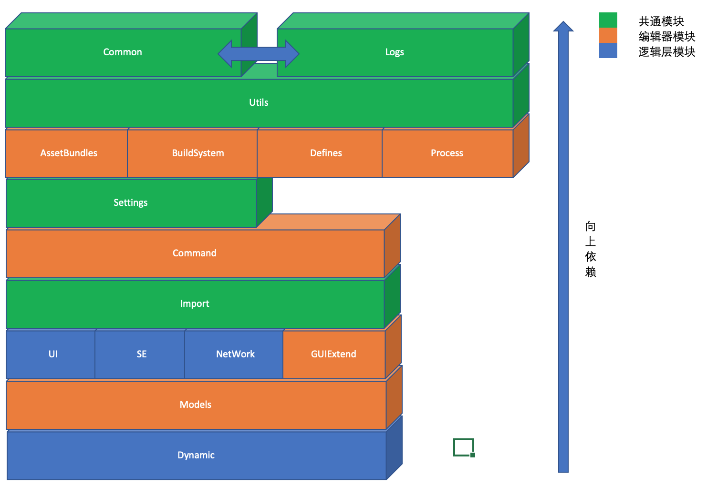

# 目录
[返回主目录](./README.md#1%E6%A6%82%E8%A6%81)

--------------------------------

### [1.概要](./General.md#1%E6%A6%82%E8%A6%81-1)

#### [1.1.架构](./General.md#11%E6%9E%B6%E6%9E%84-1)

#### [1.2.共通](./General.md#12%E5%85%B1%E9%80%9A-1)

##### [1.2.1.类方法扩展](./General.md#121%E7%B1%BB%E6%96%B9%E6%B3%95%E6%89%A9%E5%B1%95-1)

##### [1.3.日志](./General.md#131%E6%97%A5%E5%BF%97-1)

##### [1.3.1.分类&等级分类](./General.md#1311%E5%88%86%E7%B1%BB%E7%AD%89%E7%BA%A7%E5%88%86%E7%B1%BB-1)

##### [1.3.2.日志文件输出](./General.md#1313%E6%97%A5%E5%BF%97%E6%96%87%E4%BB%B6%E8%BE%93%E5%87%BA-1)

#### [1.4.工具](./General.md#13%E5%B7%A5%E5%85%B7-1)

#### [1.5.其他](./General.md#14%E5%85%B6%E4%BB%96-1)

##### [1.5.1.Process](./General.md#141process-1)

--------------------------------

## 1.概要
[返回目录](./General.md#%E7%9B%AE%E5%BD%95)

工程架构设计尽量采用分层设计。以便能在以后的新项目中能`横向扩展`和避免`重复开发`。

### 1.1.架构
[返回目录](./General.md#%E7%9B%AE%E5%BD%95)

架构详细如`图1-1-1`

| `图 1-1-1` 架构图 |
| :-----: |
||

上图编辑文件：[下载](./ReadMe/General/UnityPlugins架构图.xlsx)

`模式`:分开发模式和编辑器模式。

| 模块 | 说明 | 模式 | 备注 |
|:------|:----|:---:|:----|
| Common | 共通模块 | Both | 定义了一些共通的模块，基类以及定义。<BR/> 详细内容包含如下：<BR/> * Base `相关基类定义。`<BR/> * Comparer:`公用比较器定义`<BR/> * Counter:`顺计时/倒计时计数器相关定义。包括时间/数字等`<BR/> * Const:`全局常量定义。` <BR/> * Extend:`扩展模块`。定义了一些Unity的系统类的一些扩展。详情参看:[1.2.1.类方法扩展](./General.md#121%E7%B1%BB%E6%96%B9%E6%B3%95%E6%89%A9%E5%B1%95-1)  |
| Logs | 日志模块 | `Development Mode Only` | 重定向了Unity日志。并且对日志进行了分级。可以通过日志等级过滤输出的日志。<BR/>该模块与`Common`为相互依赖关系。 |
| Utils | 工具模块 | Both | 定义了一些全局用的工具类。<BR/> 详细内容包含如下：<BR/> * UtilsAsset:`*.asset文件相关操作`<BR/> * UtilsDateTime:`时间/日期相关操作`<BR/> * UtilsJson:`Json序列化操作`<BR/> * UtilsBytes:`二进制数据处理模块`<BR/> * UtilsLua:`保留` <BR/> * UtilsLog `日志相关`<BR/> * UtilsTools `工具类` |
| AssetBundles | AssetBundles 打包/加载用模块 | Both |  包含资源打包设定，打包文件依赖列表，以及打包结果列表导出等功能。。<BR/> 详细内容包含如下：<BR/> * AssetBundlesManager `AssetBundles加载管理器` <BR/> * BundlesConfig `打包设定文件`<BR/> * BundlesMap `打包依赖文件` <BR/> * BundlesResult `打包结果列表` <BR/> * DataLoader `AB加载模块。`可以自动切换是在Resources目录下还是下载目录下。 |
| BuildSystem | 打包系统 | `Editor Mode Only` | 包含打包日志的输出，以及Android/iOS打包的相关设定。<BR/> 详细内容包含如下： <BR/> * AndroidSDK `AndroidSDK的扩展。如：华为，天鸽+易接`。<BR/> * iOS `导出用Xcode相关设定` <BR/> * Settings `Android/iOS打包相关设定。目前只包含iOS(即XCode)` |
| Defines | 宏定义 | `Editor Mode Only` | 全局宏定义设定 |
| Settings | 系统信息设定 | Both | 定义了App系统级别的相关设定。<BR/> 详细内容包含如下：<BR/> * 一般信息设定 <BR/> * 音效相关设定 <BR/> * 网络设定 <BR/> * Tips相关设定。用于下载进度条/加载进度条。在进行中时动态刷线一些相关信息的刷新。`此处会与本地化有所关联。` |
| Command | 命令行设定 | `Editor Mode Only` | 用于部署`Teamcity`或者`Jenkins`(推荐)中，自动打包时使用。<BR/> 详细内容包含如下：<BR/> * AssetBundlesBuild:`AB包打包` <BR/> * DefinesWindow:`宏定义窗口` <BR/> * ProjectBuild:`Android/iOS打包` |
| Process | 系统进程相关设定 | `Editor Mode Only` | Unity3d工程中有时候需要执行一些脚本。来部署一些设定。考虑到OSX系(`Shell`)/Windows系(`*.bat`)都与平台相关，所以选用Python。 |
| UI | UI相关脚本定义 | Both |详细内容包含如下：<BR/> * AppVersionInfo `APP版本信息`<BR/> * DontDestroy `不释放Gameobject对象脚本` <BR/> * HandleDefines `全局句柄定义` <BR/> * IProgress `进度条相关接口定义。可适用于加载进度条/下载进度条` <BR/> * ProgressTips `进度条Tips` <BR/> * UIImageAutoNativeSize `自动显示Image原始尺寸`  |
| SE | 音效相关设定 | Both | 包含：SE+BGM。<BR/> 详细设定与音效管理器关联。 |
| Network | 网络相关设定 | Both | 包含http/https/socket等相关操作，以及request/response等相关接口定义，消息的派发等等<BR/>`当前版本为保留版本，尚未实现上述功能。` |

### 1.2.共通
[返回目录](./General.md#%E7%9B%AE%E5%BD%95)

共通模块包含以下类
```
* ClassExtension
* DataBase
* AssetBase
* EditorBase
* ErrorInfo
* HandlersDefine
* ManagerBase
* OptionsDefine
* SingletonBase
```

* ClassExtension

该类扩展了一下方法：

| 方法/函数 | 说明 | 返回值 | 备注 |
| :-- | :-- | :-- | :-- |
| void DebugLog(string iFormat, params object[] iArgs) | Debug日志 | - | 通用 |
| void Info(string iFormat, params object[] iArgs) | 信息日志(默认：运行日志) | - | 常用于日常开发中Debug用 |
| void Warning(string iFormat, params object[] iArgs) | 警告日志 | - | - |
| void LInfo(string iFormat, params object[] iArgs) | 信息:逻辑(LI) | - | 用于输出相关的逻辑日志。如：API请求参数，回复参数 |
| void Error(string iFormat, params object[] iArgs) | 错误日志 | - | - |
| void Fatal(string iFormat, params object[] iArgs) | 致命日志 | - | 用以手机系统严重错误，致命错误等。常在发生异常时收集。 |

实现上述接口的有以下几个类：

``` text
1. ClassExtension
2. UObjectExtension : UnityEngine.Object -> 考虑改成类扩展的方式。目前暂时保留
3. SObjectExtension : System.object -> 考虑改成类扩展的方式。目前暂时保留
```

其他还有一些`类方法`扩展。详情可参看:[1.2.1.类方法扩展](./General.md#121%E7%B1%BB%E6%96%B9%E6%B3%95%E6%89%A9%E5%B1%95-1)

* DataBase

这里定义了可序列化的基类定义。如下：

``` cs
	/// <summary>
	/// Json数据信息.
	/// </summary>
	public class JsonDataBase : ClassExtension {
		
		/// <summary>
		/// 清空.
		/// </summary>
		public virtual void Clear() {}

		/// <summary>
		/// 初始化.
		/// </summary>
		public virtual void Init() {}

		/// <summary>
		/// 重置.
		/// </summary>
		public virtual void Reset() {
			// 清空
			Clear ();
			// 初始化
			Init ();
		}

		/// <summary>
		/// 当前对象的字符串化文字
		/// </summary>
		/// <returns>字符串化文字</returns>
		public override string ToString () {
			return UtilsJson<JsonDataBase>.ConvertToJsonString(this);
		}
	}
```

对上述类的扩展有以下几个类

``` C#
1. JsonDataBase<T> : JsonDataBase 
2. JsonListDataBase<T> : JsonDataBase
3. OptionsDataBase<T1, T2> : JsonDataBase
```

上述的几个扩展类不仅仅可以用于`*.asset`文件的数据部分定义，也可以用在网络通信中的请求和回复数据的自动解析。


* AssetBase

该类为所有`*.asset`文件的基类，定义了文件的定义，导入/导出（*.json）等接口定义。

`IAssetBase`接口定义如下:

| 方法/函数 | 说明 | 返回值 | 备注 |
| :-- | :-- | :-- | :-- |
| bool Init(string iAssetFilePath = null) | 初始化 | 成功/失败 | 通用 |
| void Refresh() | 刷新 | - | 常用于日常开发中Debug用 |
| void Clear(bool iIsFileDelete = false, string iDirPath = null) | 清空 | - | - |
| string GetImportPath () | 取得导入路径 | 导入路径 | - |
| bool ImportFromJsonFile(bool iForceClear = true) | 导入（*.json）文件 | 成功/失败 | - |
| bool ImportFromJsonFile(string iImportDir, bool iForceClear = true) | 导入（*.json）文件 | 成功/失败 | `可以指定导入路径。` |
| string GetExportPath () | 取得导出路径 | 导出路径 | - |
| string ExportToJsonFile() | 导出（*.json）文件 | 导出路径 | - |
| string ExportToJsonFile(string iExportDir) | 导出（*.json）文件 | 导出路径 | `可以指定导出路径。` |
 
实现上述接口的有以下几个类：

``` C#
// 一般的`*.asset`文件定义基类。如：BundlesConfig.asset
1. AssetBase<T1, T2> : ScriptableObject, IAssetBase   

// 一般的`*.asset`文件定义基类（只读）。如：BundlesMap.asset
2. AssetReadOnlyBase<T1, T2> : ScriptableObject, IAssetBase 

// 一般的`*.asset`文件定义基类。如：SysSettings.asset
3. AssetOptionsBase<T1, T2, T3, T4> : ScriptableObject, IAssetBase 
```

* EditorBase

与`AssetBase`与`DataBase`配套，对`*.asset`文件的编辑器扩展。

可以参看`图1-2-1`

| `图 1-2-1` BundlesConfig.asset |
| :-----: |
||

* ErrorInfo

错误信息定义。暂时只定义了以下结构，以后可根据实际情况扩展用。

``` cs
	/// <summary>
	/// 错误详细.
	/// </summary>
	public struct ErrorInfo {
		/// <summary>
		/// 失败类型.
		/// </summary>
		public int Code;
		/// <summary>
		/// 详细信息.
		/// </summary>
		public string Detail;
		/// <summary>
		/// 重试次数.
		/// </summary>
		public string Strace;
	}
```

* HandlersDefine

一些全局的事件委托定义。暂时命名为句柄。目前只定义了以下句柄，以后可根据实际情况扩展用。

``` C#
	/// <summary>
	/// 公共句柄定义
	/// </summary>
	public delegate void ValueChangerHandler();
```

* SingletonBase

单键类定义。

1. `SingletonBase`

一般单键类定义。可用于非脚本(Unity3d)的单键类定义。
该类为泛型类。具体定义如下：

``` C#
public class SingletonBase<T> : ClassExtension where T : class, new() {
    ...
}
```

`属性`

| 属性 | 说明 | 备注 |
| :-- | :-- | :-- |
| Instance | 单键类的实例 | - |

`方法/函数`

| 方法/函数 | 说明 | 返回值 | 备注 |
| :-- | :-- | :-- | :-- |
| void Init() | 初始化函数 | - | - |
| void Reset() | 重置函数 | - | - |


2. `SingletonMonoBehaviourBase`

一般单键类定义。可用于脚本(Unity3d)的单键类定义。
该类为泛型类。具体定义如下：

``` cs
public class SingletonMonoBehaviourBase<T> : MonoBehaviourExtension 
        where T : SingletonMonoBehaviourBase<T> {
    ...
}
```

`属性`

| 属性 | 说明 | 备注 |
| :-- | :-- | :-- |
| Instance | 单键类的实例 | - |
| Initialized | 初始化标识位 | - |

`方法/函数`

| 方法/函数 | 说明 | 返回值 | 备注 |
| :-- | :-- | :-- | :-- |
| void SingletonStart() | 开始函数。与Unity3d的脚本的Start()类似。 | - | - |
| void SingletonAwake() | Awake函数。与Unity3d的脚本的Awake()类似。 | - | - |
| void SingletonDestroy() | Destroy函数。与Unity3d的脚本的OnDestroy()类似。 | - | - |

* ManagerBase

相关管理器基类定义。

`IManagerBase`:管理器接口定义如下：

| 方法/函数 | 说明 | 返回值 | 备注 |
| :-- | :-- | :-- | :-- |
| void OnStateEnter(string iCurState, string iNextState) | 状态进入函数 | - | 与游戏状态管理器相关联。<BR/>游戏状态管理器`保留，目前版本暂不包括`。 |
| void OnStateExit(string iCurState, string iNextState) | 状态退出函数 | - | 同上 |
| void OnMemoryWarning(float iCurrMem, float iDevMem, float iPerc) | 内存警告 | - | `尚未支持该功能` |
| void Close() | 关闭函数 | - | `尚未支持该功能` |

实现上述接口的有以下几个类：

``` C#
1. ManagerBehaviourBase<T> : SingletonMonoBehaviourBase<T>, 
        IManagerBase where T : ManagerBehaviourBase<T>
```

* OptionsDefine

游戏选项的相关定义。
定义如下：

``` cs

	/// <summary>
	/// Android SDK 追加选项.
	/// </summary>
	public enum SDKOptions {
		/// <summary>
		/// 无.
		/// </summary>
		None = 0x00000000,
		/// <summary>
		/// 易接SDK.
		/// </summary>
		OneSDK = 0x00000001,
		/// <summary>
		/// SQLite.
		/// </summary>
		SQLite = 0x00000002
	}

```

目前支持以下选项：

1. 易接SDK
2. SQLite

选项相关数据类主要包含以下：

``` cs
1. OptionBaseData : JsonDataBase

// 带位运算判断
2. OptionsBaseData : JsonDataBase<OptionsBaseData> 
```

#### 1.2.1.类方法扩展
[返回目录](./General.md#%E7%9B%AE%E5%BD%95)

`提示`：

为了不影响与原生类的结构，又想对其进行一定程度的扩展。可以采用类方法扩展的办法来实现。

`详细语法`说明可参看:[C# 扩展方法](https://www.w3cschool.cn/csharp/csharp-extension-methods.html)

下面对Unity本身的几个原生类进行了扩展。

* BoundsEx 包围盒类扩展
* MatrixEx 矩阵类扩展
* MonoBehaviourEx Mono脚本类扩展
* ScriptableObjectEx ScriptableObject类扩展

此外还对一些编辑器类进行了扩展

* EditorEx 编辑器类扩展
* EditorWindowEx 编辑器窗口类扩展
* GizmosEx Gizmos类扩展

1) `BoundsEx`

包围盒类扩展方法如下：

| No | 方法 | 说明 | 备注 |
| :-: | :-- | :-- | :-- |
| 1 | public static void `DrawBounds`(this Bounds iBounds, Color iColor) | 绘制包围盒(`Gizmos`模式下) | 仅编辑器模式下有效 |
| 2 | public static bool `IsInCamera`(this Bounds iBounds, Camera iCamera) | 判断当前包围盒是否在摄像机内 | - |
| 3 | public static bool `IsInCamera`(this Bounds iBounds, Camera iCamera, float iLeftX, float iRightX, float iDownY, float iUpY) | 同上 | - |
| 4 | public static bool `IsContains`(this Bounds iBounds, Bounds iCompareTo) | 判断当前包围盒是否包含另外一个包围盒 | - |

2) `MatrixEx`

矩阵类扩展方法如下：

| No | 方法 | 说明 | 备注 |
| :-: | :-- | :-- | :-- |
| 1 | public static int `ComputeOutCode`(Vector4 iPos, Matrix4x4 iProjection) | 判断坐标是否越界 | `iPos`:为归一化之后的坐标。<BR/> `iProjection`:为摄像机的投影矩阵。该判断是基于归一化(既齐次除法/透视除法。)后的判断。<BR/>参考文章:<BR/>[写给大家看的“透视除法” —— 齐次坐标和投影](https://www.jianshu.com/p/7e701d7bfd79) |
| 2 | public static int `ComputeOutCodeEx`(Vector4 iPos, Matrix4x4 iProjection, float iLeftX, float iRightX, float iDownY, float iUpY) | 同上 | - |

3) `MonoBehaviourEx`/`ScriptableObjectEx`/`EditorEx`/`EditorWindowEx`

Mono脚本扩展。此处扩展的内容`暂时`只有日志方法扩展。

| No | 方法 | 说明 | 备注 |
| :-: | :-- | :-- | :-- |
| 1 | public static void `Info`(this MonoBehaviour iScript, string iFormat, params object[] iArgs) | 日志输出。 | 日志等级 - 信息:运行(RI) <BR/>日志等级说明参看 : <BR/> [1.3.1.1.分类&等级分类](./General.md#1311%E5%88%86%E7%B1%BB%E7%AD%89%E7%BA%A7%E5%88%86%E7%B1%BB-1) |
| 2 | public static void `LInfo`(this MonoBehaviour iScript, string iFormat, params object[] iArgs) | 同上 | 日志等级 - 信息:逻辑(LI) |
| 3 | public static void `Warning`(this MonoBehaviour iScript, string iFormat, params object[] iArgs) | 同上 | 日志等级 - 警告 |
| 4 | public static void `Error`(this MonoBehaviour iScript, string iFormat, params object[] iArgs) | 同上 | 日志等级 - 错误 |
| 5 | public static void `Fatal`(this MonoBehaviour iScript, string iFormat, params object[] iArgs) | 同上 | 日志等级 - 致命错误 <BR/> 多用于捕捉到`异常`时。 |

`重要`:
由于对上述类进行了扩展，所以在继承上述类的子类中，可以直接使用上述已扩展的方法。示例代码如下：

``` cs
	/// <summary>
	/// 日志测试脚本
	/// </summary>
	public class LogTest : MonoBehaviour
	{
	    void Awake()
	    {
	        this.Info("OnEnable():{0}", "Log args test(string - Info)");
	        this.LInfo("OnEnable():{0}", "Log args test(string - LInfo)");
	        this.Warning("OnEnable():{0}", "Log args test(string - Warning)");
	        this.Error("OnEnable():{0}", "Log args test(string - Error)");
	        this.Fatal("OnEnable():{0}", "Log args test(string - Fatal)");
	    }
	} 
```

4) `GizmosEx`

Gizmos类扩展。

| No | 方法 | 说明 | 备注 |
| :-: | :-- | :-- | :-- |
| 1 | public static void `DrawViewFrustum`(Camera iCamera, Color iColor) | 绘制视锥体 | - |
| 2 | public static void `DrawViewFrustumEx`(Camera iCamera, float iLeftX, float iRightX, float iDownY, float iUpY, Color iColor) | 同上 | - |

### 1.3.工具
[返回目录](./General.md#%E7%9B%AE%E5%BD%95)

工具类中包含以下相关部分：

```
 UtilsWindow (仅编辑器模式)
 UtilsAsset
 UtilsDateTime
 UtilsJson
 UtilsLog
 UtilsTools
```

* UtilsWindow (仅编辑器模式)

窗口创建相关的工具类(泛型)。

`方法/函数`

| 方法/函数 | 说明 | 返回值 | 备注 |
| :-- | :-- | :-- | :-- |
| T1 CreateWindow<T1,T2>(T2 iConfInfo) <BR/> where T1 : EditorWindow <BR/> where T2 : WindowConfInfoBase | 创建窗口 | 创建的相关窗口的类实例 | - |

* UtilsAsset

`*.asset`相关文件的创建，导入/导出相关的工具类(泛型)。

`方法/函数`

| 方法/函数 | 说明 | 返回值 | 备注 |
| :-- | :-- | :-- | :-- |
| void SetAssetDirty(Object iTarget) | 标记目标 | - | 主要用于选中当前目标对象 |
| void AssetsRefresh() | 刷新Asset | - | `仅编辑器模式`下有效。<BR/>包括刷新和保存 |
| static T CreateAsset<T> (string iDirPath = null) where T : ScriptableObject | 创建Asset文件 | Asset文件关联的类对象实例 | - |
| static string GetAssetFileDir (string iDirPath = null) | 取得Asset文件的所在目录的路径 | 所在目录的路径 | - |
| static string GetAssetFilePath<T> (string iDirPath = null)  where T : Object | 取得Asset文件的所在目录的路径 | 所在目录的路径 | - |
| static string GetJsonFilePath<T> (string iDirPath = null) | 取得导入/导出用Json文件路径 | 导入/导出用Json文件路径 | - |
| static T ReadSetting<T>(string iDirPath = null) where T : ScriptableObject | 读取相关的Asset文件 | Asset文件关联的类对象实例 | - |
| static void DeleteFile<T> (string iDirPath = null) where T : JsonDataBase | 删除文件 | - | - |
| static T LoadAssetFile<T>(string iPath) where T : Object | 加载Asset文件 | Asset文件关联的类对象实例 | - |
| static T ImportDataByDir<T>(out bool iIsFileExist, string iJsonFileDir)  | 导入相关Asset文件的数据。数据格式为：`Json`格式。 | Asset文件关联的类对象实例 | - |
| static T ImportDataByPath<T>(out bool iIsFileExist, string iJsonFilePath) | 同上 | Asset文件关联的类对象实例 | - |
| static string ExportData<T>(T iInstance, string iJsonFileDir = null) | 导出相关Asset文件的数据。数据格式为：`Json`格式。 | 导出文件路径 | - |
| static void ClearDirectory(string iDir) | 清空目录 | - | 会清空该文件夹下所有文件及子文件夹中的信息 |
| static void CopyDirectory(string iFromDir, string iToDir)  | 拷贝文件夹 | - | 会自动在目标文件夹中创建与源文件中相应的目录结构 |
| static bool CheckAndCreateDirByFullDir(string iDir) | 校验并创建文件夹 | 成功/失败 | 校验指定路径的文件夹，若不存在文件夹或子文件夹，则创建 |
| static string CheckMatchPath(string iTargetPath) | 检测匹配路径 | 匹配路径 | 反向校验指定路径。直到Application.dataPath。并返回相应的匹配到的相对路径。 |

* UtilsDateTime

时间/日期相应处理。

`方法/函数`

| 方法/函数 | 说明 | 返回值 | 备注 |
| :-- | :-- | :-- | :-- |
| static bool IsBeforeDate (string iStartDate) | 判断是否在开启日期之前 | 是/否 | - |
| static bool CheckDate (string iStartDate, string iEndDate) | 检测当前日期是否在指定开始/结束日期之间。 | 是/否 | - |

* UtilsJson

Json数据和序列化对象相互转换的工具类。（泛型）

`方法/函数`

| 方法/函数 | 说明 | 返回值 | 备注 |
| :-- | :-- | :-- | :-- |
| static T ConvertFromJsonString(string iJsonStr) | 将相应的Json字符串转换成相应的序列化对象 | Asset文件关联的类对象实例 | - |
| static string ConvertToJsonString(T iObject) | 将相应的Asset文件关联的类对象实例转换为Json字符串 | - |

* UtilsTools

相关的全局的Tools的定义

`方法/函数`

| 方法/函数 | 说明 | 返回值 | 备注 |
| :-- | :-- | :-- | :-- |
| static string GetMd5ByFilePath(string iFilePath) | 取得文件的MD5码 | MD5码 | - |
| static T CreateInstance<T>( <BR/>string iNameSpace,string iClassName, <BR/>params object[] iParams) | 创建实例对象 | 实例对象 | - |
| static float GetDownloadDataSize(long iTotalSize) | 取得下载数据大小 | 数据大小（单位：KB/MB) | 会根据实际大小自动变换单位。（KB/MB）|
| static string GetUnitByDataSize(long iDataSize)  | 根据数据大小取得数据单位 | 数据单位(KB/MB) | - |
| static void HttpsCertificateSettings() | Https证书相关设定 | - | 该设定可以跳过证书验证。 |

#### 1.3.1.日志
[返回目录](./General.md#%E7%9B%AE%E5%BD%95)

定义了日志等级以及分类。并重定向了日志，用颜色加以区分。也可以通过系统设定来指定是否将日志输出到日志文件中，以备排查。日志系统的输出(包括日志文件的输出，都采用了`JobSystem`来实现，尽量不占用`主线程的CPU消耗`。)

##### 1.3.1.1.分类&等级分类
[返回目录](./General.md#%E7%9B%AE%E5%BD%95)

``` cs
    /// <summary>
    /// Log日志等级定义（级别越高，日志输出越少。）.
    /// 输出的日志只输出大于等于当前日志级别的日志。
    /// </summary>
    public enum LogLevel {
        Invalid = -1,
        /// <summary>
        /// 全部输出(A).
        /// </summary>
        All = 0,
        /// <summary>
        /// Debug(T).
        /// </summary>
        Debug = 1,
        Test = Debug,
        /// <summary>
        /// 信息:运行(RI).
        /// </summary>
        RInfo = 2,
        /// <summary>
        /// 警告(W).
        /// </summary>
        Warning = 3,
        /// <summary>
        /// 信息:逻辑(LI).
        /// </summary>
        LInfo = 4,
        /// <summary>
        /// 错误(E).
        /// </summary>
        Error = 5,
        /// <summary>
        /// 致命日志(F).
        /// </summary>
        Fatal = 6,
        /// <summary>
        /// 全关闭.
        /// </summary>
        Off = 7
    }
```

`注意`:

* 日志输出只输出日志等级`高于(包括等于)`当前日志等级的日志。例如：当前等级为：LInfo - 信息:逻辑(LI)。则，日志只输出：LInfo - 信息:逻辑(LI)/Error - 错误(E)/Fatal - 致命日志(F)的日志信息。
* 日志等级设定，详细参看:[2.系统设定](./SysSettings.md#2%E7%B3%BB%E7%BB%9F%E8%AE%BE%E5%AE%9A-1)
* 日志分为:`一般日志`和`打包日志`。详情参看:[1.3.1.2.重定向](./General.md#1312%E9%87%8D%E5%AE%9A%E5%90%91-1)

##### 1.3.1.2.重定向
[返回目录](./General.md#%E7%9B%AE%E5%BD%95)

日志的格式

* 一般日志

> [YYYY-MM-DD HH:MM:SS.ms][+前后花费时间 ms][日志No][日志Tag][类名] `日志内容`

如下图：

| `图 1-3-1-2-1` 日志输出 |
| :-----: |
||

`备注`:

①:上述日志输出的实际内容

2019-12-23 17:48:59.921(+0 ms)[0][`RI`] [LogTest] OnEnable():Log args test(string - Info)

`RI`:为日志等级Tag。与日志等级定义中`注释内容`一致。并对日志的等级做了`颜色`区分。

②:双击当前日志，可以根据日志栈的内容，定位到相应的代码中。

上述日志在Android环境/真机模式下可以配合`adb logcat`命令对日志进行`关键字`过滤。命令如下：

```shell
 adb logcat | grep "LogTest"
```

`注意`：`adb`和`logcat`请自行`度娘`脑补。

* 打包日志

打包日志，为了精确区分当前打包的状态，并配合TeamCity/Jenkins上打包状态的追踪，所以相关日志处理与一般日志相比会有所区别(当然`颜色`也同样有所区别。)。我们先来看看打包日志的接口。

| No | 方法 | 说明 | 备注 |
| :-: | :-- | :-- | :-- |
| 1 | public static void BuildStart(string iScope, string iLog = null) | 打包日志开始 | * iScope : `打包范围`。一般为`方法名`。会压入当前打包信息栈中，用以记录当前打包范围。<BR/> * 以`+`标示。<BR/>* iLog : 日志内容。<BR/> * 如`图 1-3-1-2-2` 打包日志输出中的① <BR/> * 该方法与`BuildEnd`必须成对出现，且在执行的打包方法(Scope的开始和结尾) |
| 2 | public static void BuildLog(string iLog) | 一般打包日志输出 | * 会记录当前打包所在的Scope，并输出予以区分<BR/> * 以` (空格)`标示。<BR/> * 如`图 1-3-1-2-2` 打包日志输出中的② | 
| 3 | public static void BuildWarningLog(string iLog) | 警告打包日志输出 | * 会记录当前打包所在的Scope，并输出予以区分<BR/> * 以`*`标示。<BR/> * 如`图 1-3-1-2-2` 打包日志输出中的③ <BR/> * 日志输出颜色与一般警告日志输出颜色一致。 |
| 4 | public static void BuildErrorLog(string iLog) | 错误打包日志输出 | * 会记录当前打包所在的Scope，并输出予以区分<BR/> * 以`@`标示。<BR/> * 如`图 1-3-1-2-2` 打包日志输出中的④ <BR/> * 日志输出颜色与一般错误日志输出颜色一致。 |
| 5 | public static void BuildEnd() | 打包日志结束 | * 会将当前打包的`Scope`弹出打包栈，以表示当前打包`Scope`的结束。<BR/> * 以`-`标示。<BR/> * 如`图 1-3-1-2-2` 打包日志输出中的⑤ <BR/> * 该方法与`BuildStart`必须成对出现，且在执行的打包方法(Scope的结尾) |

代码实例如下：

``` cs
	/// <summary>
	/// 日志测试脚本
	/// </summary>
	public class LogTest : MonoBehaviour
	{
	    void Awake()
	    {
	#if UNITY_EDITOR
	        // 实际的执行的操作开始时
	        Loger.BuildStart("OnEnable");
	        
	        // 实际的执行的操作代码
	        ...
	        Loger.BuildLog("log");
	        
	        // 实际的执行的操作代码中发生警告时
	        ...
	        Loger.BuildWarningLog("Warning");
	        
	        // 实际的执行的操作代码中发生错误时
	        ...
	        Loger.BuildErrorLog("Error");

	        // 实际的执行的操作结束时
	        Loger.BuildEnd();
	#endif
	    }
	} 
```

| `图 1-3-1-2-2` 打包日志输出 |
| :-----: |
||

##### 1.3.1.3.日志文件输出
[返回目录](./General.md#%E7%9B%AE%E5%BD%95)

日志文件的输出详细设定参看:[2.系统设定](./SysSettings.md#2%E7%B3%BB%E7%BB%9F%E8%AE%BE%E5%AE%9A-1)

`注意`:

* 默认目录为当前工程目录下的'Output/Logs'下。若是打包的场合，则为'Output/Logs/打包No/ios或者Anroid/Logs'。打包模式下，输出目录也可有`外部参数`指定。详细参看:[3.1.命令行参数](./BuildSystem.md#31%E5%91%BD%E4%BB%A4%E8%A1%8C%E5%8F%82%E6%95%B0-1)
* 日志文件前缀以`Build/Run`区分是`打包日志`还是`运行日志`。
* 打包文件大小可以在[2.系统设定](./SysSettings.md#2%E7%B3%BB%E7%BB%9F%E8%AE%BE%E5%AE%9A-1)中进行设定，单位为:`MB`

### 1.4.其他
[返回目录](./General.md#%E7%9B%AE%E5%BD%95)

#### 1.4.1.Process
[返回目录](./General.md#%E7%9B%AE%E5%BD%95)

Unity3d工程中有时候需要执行一些脚本。来部署一些设定。考虑到OSX系(`Shell`)/Windows系(`*.bat`)都与平台相关，所以选用Python。

* 接口说明

`命名空间` : Packages.Python.Editor

`类` : PythonScript

`方法/函数（接口）` : 

``` cs
    /// <summary>
	/// 运行Path脚本
	/// 默认
	/// </summary>
	/// <param name="iPath">脚本路径</param>
	/// <param name="iWorkDir">工作目录（默认：Application.dataPath）</param>
	public static void Run(string iPath, string iWorkDir = null)
```

`注意`：

1. 该种调用方式，在不可指定单独调用Python中执行的方法。返回值，也需要用`print`的方式返回。其他若有特殊需求，以实际`Python`脚本运行/调试为准。示例如下：

``` python
#!/usr/bin/env python
# -*- coding: UTF-8 -*-

import sys
import os
import json

# 将作为返回值
print "TestOK"

# 自定义方法
def Init() :
    return json.dumps(sys.path)

if __name__ == '__main__':
    # 调用方法/函数
    result = Init()
    # 第2个返回值
    print result
```

2. 实际调用示例如下：

``` cs
    /// <summary>
    /// 运行Python测试文件
    /// </summary>
    [MenuItem("Tools/Python/RunTest")]
    public static void RunTest()
    {
        // var scriptPath = string.Format("{0}/Packages/Python/Editor/Test.py", Application.dataPath);
        const string scriptPath = "./Packages/Python/Editor/Test.py";
        PythonScript.Run(scriptPath);
    }
```

`注意` :

* 默认工作目录为：`Application.dataPath`。
* 运行该功能不仅需要安装Python。还要配置相关的`环境变量`。

3. 运行结果如`图1-4-1-1` Python运行结果

| `图 1-4-1-1` Python运行结果 |
| :-----: |
||