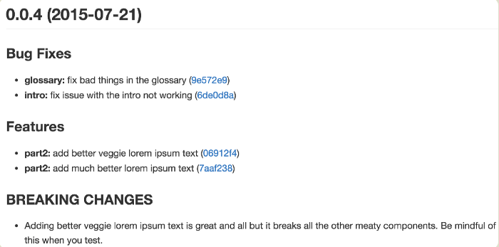
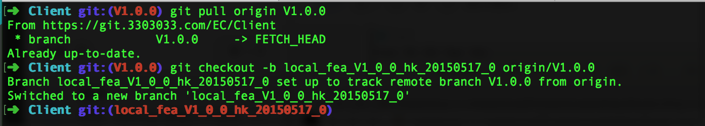
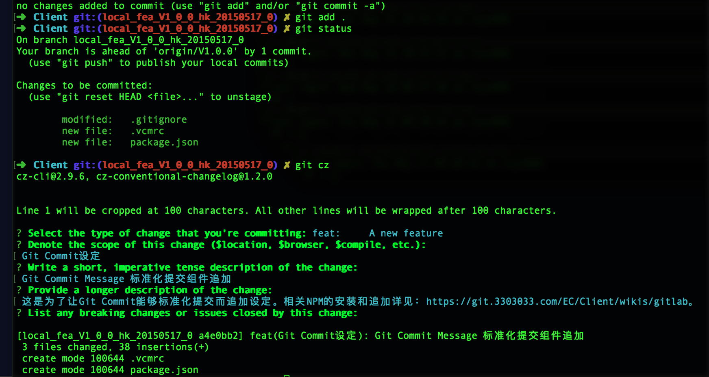
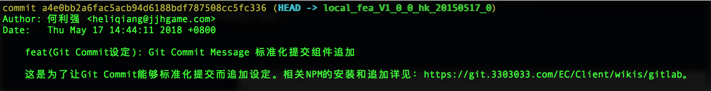
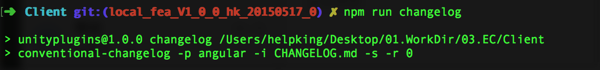
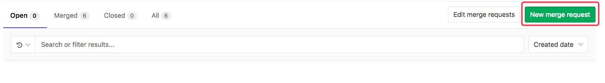
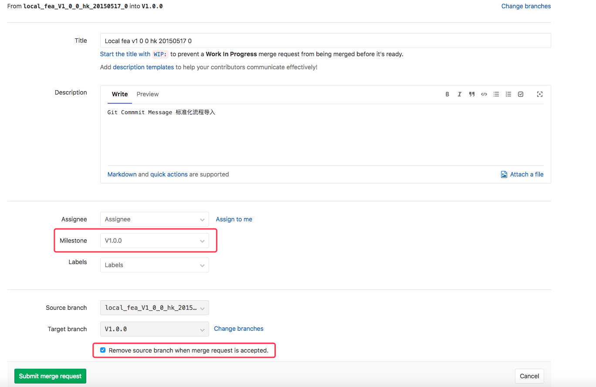

## 目录

===============================

#### [1.0.概要](GitCommitMsg.md#10%E6%A6%82%E8%A6%81-1)
#### [1.1.参考资料](GitCommitMsg.md#11%E5%8F%82%E8%80%83%E8%B5%84%E6%96%99-1)
#### [1.2.插件](GitCommitMsg.md#12%E6%8F%92%E4%BB%B6-1)
##### [1.2.1.插件安装](GitCommitMsg.md#121%E6%8F%92%E4%BB%B6%E5%AE%89%E8%A3%85-1)
#### [1.3.格式说明](GitCommitMsg.md#13%E6%A0%BC%E5%BC%8F%E8%AF%B4%E6%98%8E-1)
#### [1.4.Git分支命名](GitCommitMsg.md#14git%E5%88%86%E6%94%AF%E5%91%BD%E5%90%8D-1)
##### [1.4.1.示例](GitCommitMsg.md#141%E7%A4%BA%E4%BE%8B-1)
#### [1.5.Git Merge Request](GitCommitMsg.md#15git-merge-request-1)
===============================

## 1.0.概要
[返回目录](GitCommitMsg.md#%E7%9B%AE%E5%BD%95)

为了针对Git的commit时所写的Message，进行规范。并在发布新版本时，可以统一导出版本变更Log。
详细可参看`如图 1-0-1` 版本变更Log。为了实现这样的功能我们需要简单配置部署以下本地环境。

| `图 1-0-1` 版本变更Log |
| :------:|
|  |


### 1.1.参考资料
[返回目录](GitCommitMsg.md#%E7%9B%AE%E5%BD%95)

参考网址：

* [注释规范](http://www.ruanyifeng.com/blog/2016/01/commit_message_change_log.html)
* 

### 1.2.插件
[返回目录](GitCommitMsg.md#%E7%9B%AE%E5%BD%95)

插件的安装依赖Npm。Npm的安装请自行`度娘`。

需要的插件安装如下：

* Commitizen
* Validate-Commit-Msg
* Conventional-Changelog

#### 1.2.1.`插件安装`
[返回目录](GitCommitMsg.md#%E7%9B%AE%E5%BD%95)

1) `Commitizen`(书写规范插件)

安装命令如下(全局安装)：

> npm install -g commitizen

然后在项目的目录下运行如下命令，使其支持`Angular`的`Commit message`格式。


> commitizen init --yes cz-conventional-changelog --save --save-exact

`FAQ`:若是提示没有`package.json`文件，则试用以下命令生成该文件

> npm init 

2) `Validate-Commit-Msg`(注释书写规范检测) `暂时失效，还没解决`

安装命令如下：

> npm install -g --save-dev validate-commit-msg

开源工程`GitHub`地址：

https://github.com/conventional-changelog-archived-repos/validate-commit-msg

3) `Conventional-Changelog`（变更日志生成工具）

安装命令如下：

> npm install -g conventional-changelog(不带命令行工具)


> npm install -g conventional-changelog-cli(带命令行工具) <- `推荐`

开源工程`GitHub`地址：

https://github.com/conventional-changelog/conventional-changelog

4) `package.json`设置。

[详情参看](./npm)

在工程根目录下的`package.json`内容如下：

`devDependencies`中指定的包版本信息，可用命令`npm list -g --depth 0`查询

```
{
  "name": "application-name",
  "version": "0.1.0",
  "scripts": {
    "commitmsg": "validate-commit-msg",
    "commit": "git-cz ",
    "changelog": "conventional-changelog -p angular -i CHANGELOG.md -s -r 0"
  },
  "devDependencies": {
    "commitizen": "^2.3.0",  // 实际的版本号.
    "validate-commit-msg": "^2.11.1",  // 实际的版本号.
    "conventional-changelog-cli": "^1.2.0",  // 实际的版本号.
    "husky": "^0.13.1"  // 实际的版本号.
  },
  "config": {
    "commitizen": {
      "path": "cz-conventional-changelog"
    }
  }
}
```

5）`.vcmrc`文件

在工程根目录新建`.vcmrc`文件，并且文件内容为

```
{
  "types": ["feat", "fix", "docs", "style", "refactor", "perf", "test", "build", "ci", "chore", "revert"],
  "scope": {
    "required": false,
    "allowed": ["*"],
    "validate": false,
    "multiple": false
  },
  "warnOnFail": false,
  "maxSubjectLength": 100,
  "subjectPattern": ".+",
  "subjectPatternErrorMsg": "subject does not match subject pattern!",
  "helpMessage": "",
  "autoFix": false
}
```

### 1.3.`格式说明`
[返回目录](GitCommitMsg.md#%E7%9B%AE%E5%BD%95)

Git 提交格式一览如`图 1-3-1`

| `图 1-3-1` Git 提交格式一览 |
| :------:|
|  |

* 标准格式

```
<type>(<scope>): <subject>
<BLANK LINE>
<body>
<BLANK LINE>
<footer>
```

所有的`type`类型如下：

> `type`代表某次提交的类型，比如是修复一个`bug`还是增加一个新的`feature`。

* feat： 新增 feature
* fix: 修复 bug
* docs: 仅仅修改了文档，比如 README, CHANGELOG, CONTRIBUTE等等
* style: 仅仅修改了空格、格式缩进、逗号等等，不改变代码逻辑
* refactor: 代码重构，没有加新功能或者修复 bug
* perf: 优化相关，比如提升性能、体验
* test: 测试用例，包括单元测试、集成测试等
* chore: 改变构建流程、或者增加依赖库、工具等
* revert: 回滚到上一个版本

`格式要求`：

```
# 标题行：50个字符以内，描述主要变更内容
#
# 主体内容：更详细的说明文本，建议72个字符以内。 需要描述的信息包括:
#
# * 为什么这个变更是必须的? 它可能是用来修复一个bug，增加一个feature，提升性能、可靠性、稳定性等等
# * 他如何解决这个问题? 具体描述解决问题的步骤
# * 是否存在副作用、风险? 
#
# 尾部：如果需要的化可以添加一个链接到issue地址或者其它文档，或者关闭某个issue。
```

### 1.4.Git分支命名
[返回目录](GitCommitMsg.md#%E7%9B%AE%E5%BD%95)

`Git分支与版本发布规范`：

* 基本原则：master为保护分支，不直接在master上进行代码修改和提交。
* 开发分支。所有新版本开发，会切出一个版本分支。如:Dev_V_1_0_0
* 本地分支。都以开发分支为主分支，进行作业。并且checkout到本地。

本地分支`命名规则`

> local_`类型`_`版本号`_`担当者`_`日期(格式:YYYYMMDD)`_`No`

1. 类型：fea(feature的简称):功能开发; fix(bugfix的简称):Bug修正; rfc(refactor的简称):功能重写或者版本翻新／升级;
1. 版本号：开发版本号
1. 担当者：开发的程序姓名
1. 日期：该功能开发开始日
1. No：当前开发的功能No。可以自定义，避免同一个人同一天担当多个功能开发。

#### 1.4.1.示例
[返回目录](GitCommitMsg.md#%E7%9B%AE%E5%BD%95)

* 切分支

`命令`：

> `保持切出来之前最新状态`
> 
> git pull origin V1.0.0  
>  
> `切出分支`
> 
> git checkout -b `local_fea_V1_0_0_hk_20150517_0` origin/V1.0.0

如`图 1-4-1-1` 切新分支：

| `图 1-4-1-1` 切新分支 |
| :------:|
|  |

* 提交

`命令`：

> git add .
> 
> 所有提交不用`git commit`换用`git cz`
> 
> git cz

如`图 1-4-1-2` Git Cz：

| `图 1-4-1-2` Git Cz |
| :------:|
|  |

实际产生的Log结果如`图 1-4-1-3` Git Log：

| `图 1-4-1-3` Git Log |
| :------:|
|  |

* 产生变更Log&提交

`命令`：

> npm run changelog
> 
> git tag V1.0.0
> 
> git push origin `local_fea_V1_0_0_hk_20150517_0` 

如`图 1-4-1-4` Change Log：

| `图 1-4-1-4` Change Log |
| :------:|
|  |

变更log文件：`CHANGELOG.md`

```
<a name="1.0.0"></a>
# 1.0.0 (2018-05-17)


### Features

* **Git Commit设定:** Git Commit Message 标准化提交组件追加 ([a4e0bb2](https://git.3303033.com/EC/Client/commits/a4e0bb2))
```

### 1.5.Git Merge Request
[返回目录](GitCommitMsg.md#%E7%9B%AE%E5%BD%95)

具体步骤如`图 1-5-1` 新建Merge Request：

1) 创建Merge Request

| `图 1-4-1-4` 新建Merge Request |
| :------:|
|  |

2）指定分支

| `图 1-4-1-4` Merge Request |
| :------:|
|  |

3）填写相关信息

如果按上述的插件流程在提交时，用标准规范注释的话，在上述Merge Request中自动匹配相关的注释。如`图 1-4-1-4` Merge Request。当然也可以手动在进行更改或者修正。

4）生成Merge Request

点击画面上的按钮：Submit merge request。就可以提交上述的Merge request了。如`图 1-4-1-4` Merge Request