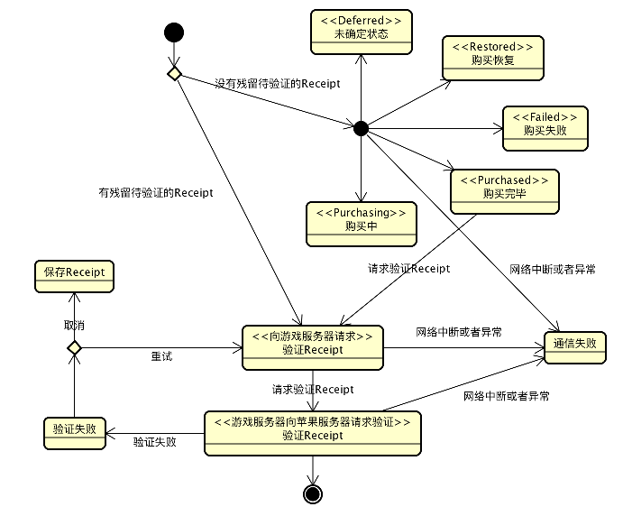
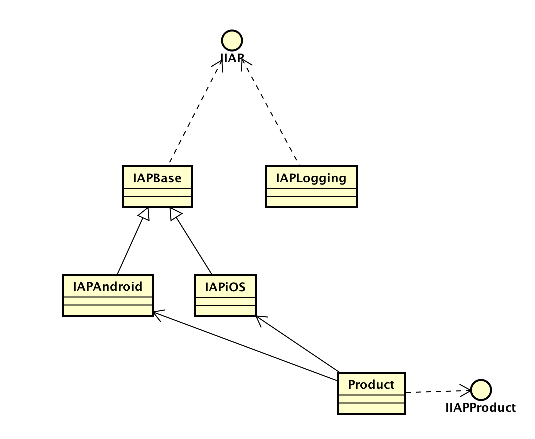
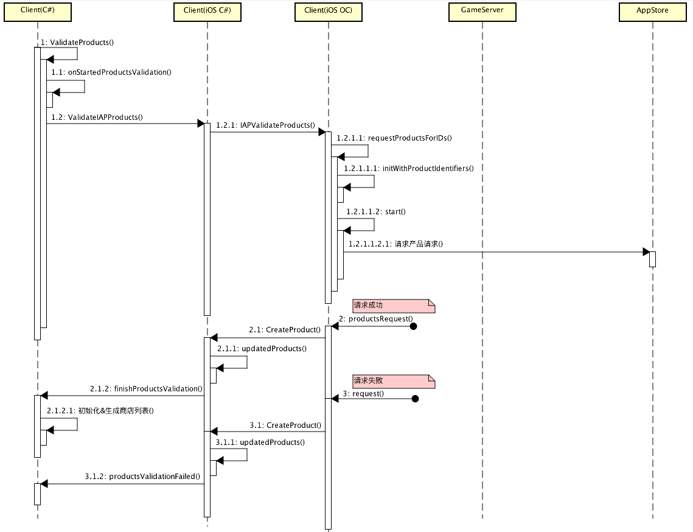
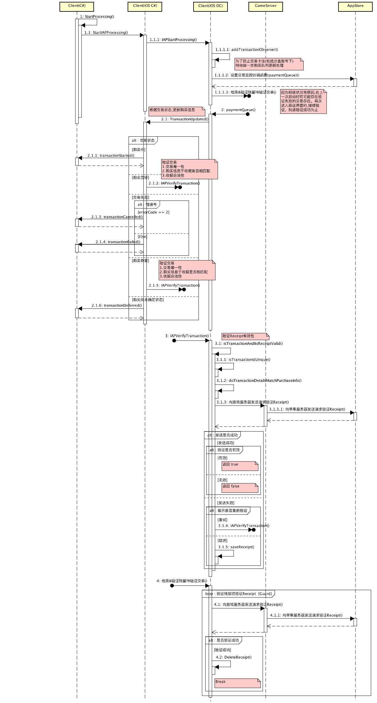
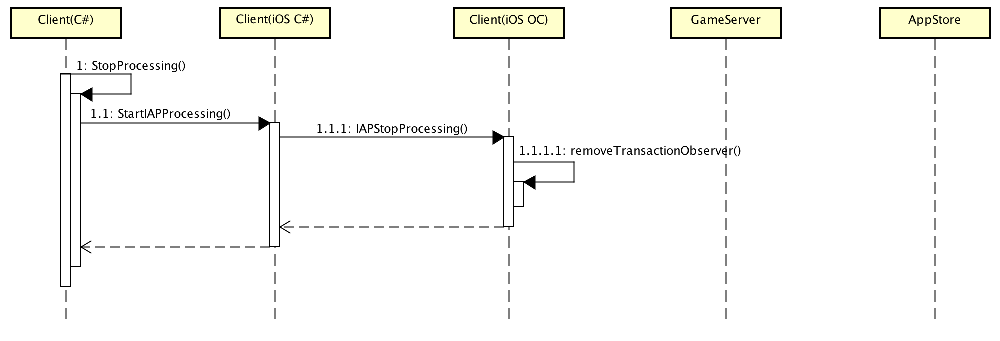
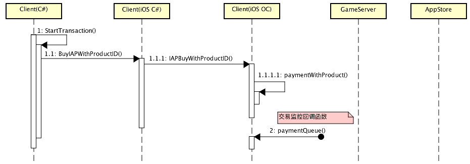
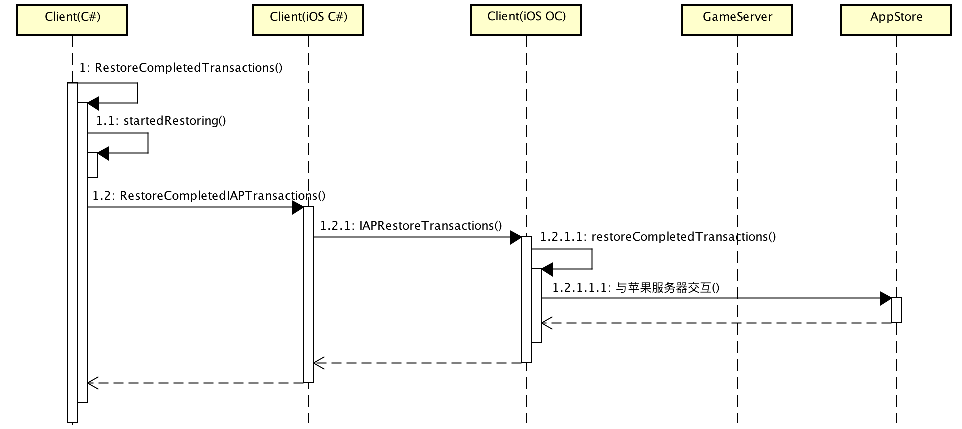

# Contents

[0.Summary](IAP.md#0summary) -> 概述

[1.Class Diagram](IAP.md#1class-diagram) -> 类图

[2.Squence Diagram](IAP.md#2squence-Diagram) -> 时序图

[2.1.Validate Products](IAP.md#21validate-products)    -> 获取产品列表

[2.2.Start Processing](IAP.md#22start-processing)      -> 开始监控交易进程

[2.3.Stop Processing](IAP.md#23stop-processing)        -> 停止监控交易进程

[2.4.Start Transaction](IAP.md#24start-transaction)    -> 开始交易

[2.5.Restore Transactions](IAP.md#25restore-transactions) -> 恢复购买

[8.Tools](IAP.md#8tools) -> 工具相关

[9.FAQ](IAP.md#9faq)

## 0.Summary
[返回目录](IAP.md#contents)

本文档单纯描述了IAP控制流程图设定，不涉及到代码实现。欢迎各位补充指正。

`状态机如下：`

| 图：0-1 (状态机)     | 
|:-------------:|
||

`注意：`

本文所述类图、状态图，时序图文件下载地址：

[IAP.asta](./IAP.asta)

`绘制工具详见：`[8.Tools](IAP.md#8tools)

## 1.Class Diagram
[返回目录](IAP.md#contents)

`类图：`

| 图：1-1     | 
|:-------------:|
||

`详细说明如下：`

| 类名/接口名 | 说明 | 备注 | 
|:-----------|:----|:----|
| IIAP       | IAP接口定义 | | 
| IAPBase    | IAP基类 | 基础操作以及一些共同方法 | 
| IAPiOS     | IAP（iOS）实现类 | iOS下，交易以及购买相关操作 |
| IAPAndroid | IAP（Android）实现类 | Android下，交易以及购买相关操作 |
| IAPLogging | IAP（带Log）实现类 | 测试用 |
| IIAPProduct | 产品接口定义 |  |
| Product | 产品类 |  |

## 2.Squence Diagram
[返回目录](IAP.md#contents)

### 2.1.Validate Products
[返回目录](IAP.md#contents)

-- 获取产品列表
在商店界面加载时，根据产品列表，生成商店。

`时序图：`

| 图：2-1-1 获取产品列表（ValidateProducts）| 
|:-------------:|
||

### 2.2.Start Processing
[返回目录](IAP.md#contents)

-- 开始监控交易进程

1) 在加载&生成完商店交易界面后，开启开始监控交易的进程。所有购买必须在这个开启监控之后，进行购买。

2) 由于网络原因或者其他错误导致Receipt验证失败的，可以允许用户选择重试。若是取消，则在本地保存收据，下一次启动时，将优先一直验证残留待验证的收据。直到成功。成功验证后，将删除版本残留待验证的收据文件。

`时序图：`

| 图：2-2-1 开始交易进程（StartProcessing）| 
|:-------------:|
||

`方法&参数说明`

| 方法名 | 参数列表 | 说明 | 备注 |
|:------|:--------|:----|:-----|
| 检测&验证残留待验证交易 VerifyTransactionByFile()| string FilePath | 本地保存的待验证Receipt文件路径 | - |
| 向游戏服务器发送请求验证Receipt   VerifyReceiptToGameServer() | Receipt   Date   UserId | 苹果收据（不加密原样发送）   日期   用户ID | - |

[参考做法](http://www.jianshu.com/p/033086546126)

### 2.3.Stop rocessing
[返回目录](IAP.md#contents)

-- 停止监控交易进程
退出商店界面或者其他异常以及错误发生时，停止监控交易进程。

`时序图：`

| 图：2-3-1 停止监控交易进程（StopProcessing）| 
|:-------------:|
||

### 2.4.Start Transaction
[返回目录](IAP.md#contents)

-- 开始交易
开始购买产品

| 函数名 | 参数列表 | 备注 | 
|:-----------|:----|:----|
|StartTransaction| string iProductId | 产品ID|
|StartTransaction| string iProductId  Int32 iQuantity| 产品ID 产品数量|

`时序图：`

| 图：2-4-1 开始交易（StartTransaction）| 
|:-------------:|
||

`备注：`
    交易监控回调函数详情参看：[2.2.Start Processing](IAP.md#22start-processing) 

## 2.5.Restore Transactions
[返回目录](IAP.md#contents)

`注意：`

该状态是在，用户卸载app后，在重装等情况下，想要恢复之前已购买的产品时，向苹果服务器提交恢复请求时发生。

一般App内部道具收费，逻辑控制在游戏服务器上时，该状态一般不会发生。`此处便不详述了。`

`时序图：`

| 图：2-5-1 恢复交易（Restore Transactions）| 
|:-------------:|
||

## 8.Tools
[返回目录](IAP.md#contents)

1） UML（类图，状态图，时序图等绘制工具astah）

`工具下载地址:`

[Windows版本(免费版 64位)](http://cdn.change-vision.com/files/astah-community-7_1_0-f2c212-jre-64bit-setup.exe)

[Mac版本(免费版)](http://cdn.change-vision.com/files/astah-community-7_1_0-f2c212-MacOs.dmg)

## 9.FAQ
[返回目录](IAP.md#contents)

