# 概述

--------------------------------

## contents

[0.机能概要说明]()

[1.AssetBundle Build](README.md#1assetbundle-build)

[1.0.Operation](README.md#10operation)

[1.1.Setting Options](README.md#11setting-options)

[1.1.1.Setting File](README.md#111setting-file)

[1.1.2.Properties](README.md#112properties)

[1.1.2.1.States](README.md#1121states)

[1.1.3.Operation Setting](README.md#113operation-setting)

[1.1.3.1.Operation Setting Options](README.md#1131operation-setting-options)

[1.1.3.2.Ignore Options](README.md#1132ignore-options)

[1.1.4.Others](README.md#114others)

[1.1.4.1.Export Dir](README.md#1141export-dir)

[1.1.4.2.AssetBundle Reference Map File](README.md#1142assetbundle-reference-map-file)

[2.Upload](README.md#2upload)

[2.0.Upload List](README.md#20upload-list)

[2.0.1.Check Mode](README.md#201check-mode)

[2.0.2.Target Setting Detail](README.md#202target-setting-detail)

[2.1.Operation](README.md#21operation)

[2.2.Local BackUp](README.md#22local-backup)

[2.3.Result](README.md#23result)

[3.Download](README.md#3download)

[3.0.Download List](README.md#30download-list)

[3.1.Operation](README.md#31operation)

[3.2.Download Dir Setting](README.md#32download-dir-setting)

[3.3.Download Manager Script](README.md#33download-manager-script)

[4.AssetBundle Load](README.md#4assetbundle-load)

[4.1.Synchronous Load Interface](README.md#41synchronous-load-interface)

[4.2.Asynchronous Load Interface](README.md#42asynchronous-load-interface)

[4.2.2.Asynchronous CallBack Define](README.md#422asynchronous-callback-define)

[4.2.2.1.Load Target Type Define](README.md#4221load-target-type-define)

[5.Others Setting](README.md#others-setting)

[5.0.Correlation Type Define](README.md#50correlation-type-define)

[5.0.1.Build Mode Define](README.md#501build-mode-define)

[5.1.Build Info Setting](README.md#51build-info-setting)

[5.2.Server Config](README.md#52server-config)

[5.2.1.ProgressTips](README.md#521progress-tips)

[5.3.Progress Bar](README.md#53progress-bar)

[5.3.1.Create UI](README.md#531create-ui)

[6.Build](README.md#6build) -> 打包成Android/iOS（apk文件/ipa文件）

[6.1.Android Build](README.md#61android-build) -> 打包Android(生成apk文件)

[6.2.iOS Build](README.md#62ios-build) -> 打包iOS（先导出iOS文件后，用Xcode生成ipa文件）

[8.IAP](README.md#8iap)

[9.FAQ](README.md#9faq)

[10.Remaining Problems](README.md#10remaining-problems)

--------------------------------

### 1.AssetBundle Build
[返回目录](./README.md#contents)

#### 1.0.Operation

| 图：1-0-1     | 
|:-------------:|
||

打包操作：

* iOS
`Menu -> Tools -> AssetBundles -> BuildForIOS`

* Android
`Menu -> Tools -> AssetBundles -> BuildForAndroid`

`当然，在导出之前，需要对导出对象进行设定。`

`详情参看：`[1.1.Setting Options](README.md#11setting-options)

#### 1.1.Setting Options
##### 1.1.1.Setting File

`文件名：BundlesConfig.asset`
`路径：Resources/Conf`

| 图：1-1-0 (初始化) | 
|:-------------:|
|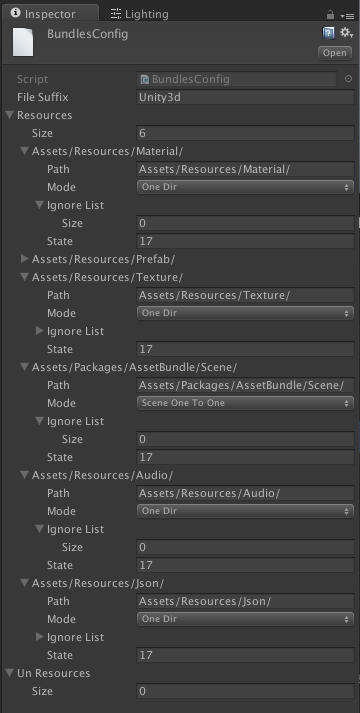|

`该依赖文件，最后将导出成Json文件，跟所有打包成功的AssetBundle文件一同上传到CDN服务上。`

##### 1.1.2.Properties
```
1） FileSuffix：AssetBundle打包后的文件后缀名
2） Resoures：欲打包的资源对象列表
	a) Path : 目录
	b) Mode : 打包模式
	c) IgnoreList : 忽略列表（在忽略列表中的文件，将不被打包进AssetBundle包。）
	d) State : 状态
3） UnResoures：非打包对象一览（在ipa/apk打包前，移出工程，以免打包进二进制包。打包完后，移回相应目录，以免影响正常开发）
```

`忽略列表详情参看：`[1.1.3.2.Ignore Options](README.md#1132ignore-options)

`状态详情参看：`[1.1.2.1.States](README.md#1121states)

###### 1.1.2.1.States

状态设定采用位控制设定。

定义如下：
<code><pre>
	// Bundle状态.
	public enum TBundleState {
		// 无.
		None = 0x00000000,
		// IOS需要导出.
		IosNeed = 0x00000001,
		// IOS导出完成.
		IosCompleted = 0x00000002,
		// 安卓需要导出.
		AndroidNeed = 0x00000010,
		// 安卓导出完成.
		AndroidCompleted = 0x00000020,
		// 所有都需要导出.
		AllNeed = (IosNeed | AndroidNeed),
		// 所有都需要导出.
		AllCompleted = (IosCompleted | AndroidCompleted)
	}
</code></pre>

* 状态说明

| 状态              | 值（十六进制） | 值（十进制）    |  说明              | 备注                                 |
|:-----------------|:-------------:|:-------------:|:------------------|:-------------------------------------|
| None             | -             | -             | 无                 | 无                                   | 
| IosNeed          | 0x00000001    | 1             | iOS导出位           | 1：导出 ： 0：不导出                  | 
| IosCompleted     | 0x00000002    | 2             | iOS完成位           | 2：完成 ： 0：尚未完成                |
| AndroidNeed      | 0x00000010    | 16            | Android导出位       | 16：导出 ： 0：不导出                 | 
| AndroidCompleted | 0x00000020    | 32            | Android完成位       | 32：完成 ： 0：尚未完成               |
| AllNeed          | 0x00000011    | 17            | iOS&Android导出位   | 17：导出 ： 0：不导出                 |  
| AllCompleted     | 0x00000022    | 34            | iOS&Android导出位   | 34：完成 ： 0：尚未完成               | 

`备注：`

-> 初始状态：（IosNeed | AndroidNeed）=  0x00000011（17）

-> 仅iOS导出完成：（IosNeed | AndroidNeed | IosCompleted） = 0x00000013（19）

-> 仅Android导出完成：（IosNeed | AndroidNeed | AndroidCompleted) = 0x00000031（49）

-> 全部（iOS&Android）导出完成：（IosNeed | AndroidNeed | IosCompleted | AndroidCompleted) = 0x00000033（51）

##### 1.1.3.Operation Setting
 
 在Project窗口右键

| 图：1-1-3-0   | 
|:-------------:|
|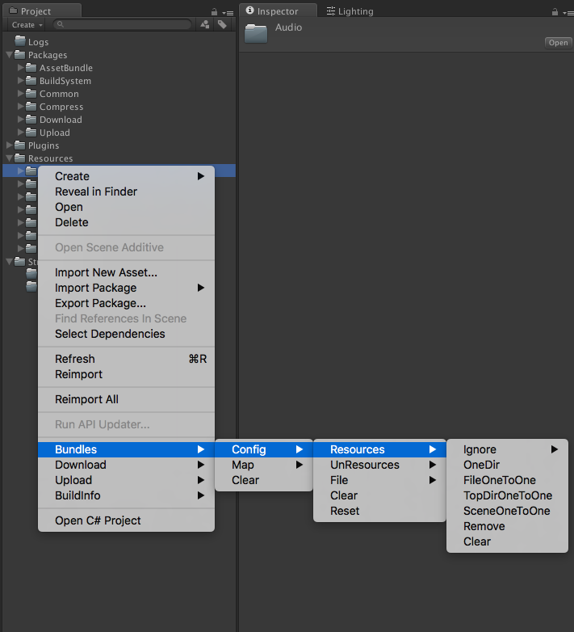|


##### 1.1.3.1.Operation Setting Options

* 操作

`
右键菜单：Bundles -> Config -> Resoures
`

| 模式           | 说明          | 备注   |
| :------------ |:-------------:| :-----|
| Ignore        | 忽略选项       | 详情参看：1.1.3.2.忽略选项|
| OneDir        | 单一目录       | 指定目录下，一个文件一个包，并添加进打包对象配置文件（BundlesConfig.asset）。如已经存在，则重置状态位。使之在下一次打包中重新变成打包对象。|
| FileOneToOne  | 单一文件模式    | 指定目录下，一个文件一个包，并添加进打包对象配置文件（BundlesConfig.asset）。如已经存在，则重置状态位。使之在下一次打包中重新变成打包对象。 |
| TopDirOneToOne | 子目录模式     | 指定目录下的子目录，一个目录一个包，并添加进打包对象配置文件（BundlesConfig.asset）。如已经存在，则重置状态位。使之在下一次打包中重新变成打包对象。 |
| SceneOneToOne | 单一场景模式    | 一个场景，一个包，并添加进打包对象配置文件（BundlesConfig.asset）。如已经存在，则重置状态位。使之在下一次打包中重新变成打包对象。 |
| Remove        | 移除    | 从当前打包对象配置文件（BundlesConfig.asset）中，移除当前选中对象。|
| Clear         | 清空    | 清空打包对象配置文件（BundlesConfig.asset）。|

##### 1.1.3.2.Ignore Options

* 操作

`
右键菜单：Bundles -> Config -> Resoures -> Ignore
`

| 图：1-1-3-2-0 | 
|:-------------:|
|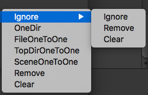|

* 选项说明

| 选项           | 说明          | 备注   |
| :------------ |:-------------:| :-----|
| Ignore        | 忽略 | 往打包对象配置文件（BundlesConfig.asset）中,相应AssetBundle包中相应对象，添加忽略文件 |
| Remove        | 移除 | 往打包对象配置文件（BundlesConfig.asset）中,相应AssetBundle包的忽略列表中，移除当前选中文件，使之在AssetBundle打包时，成为打包对象 |
| Clear         | 清空 | 清空当前打包资源对象的忽略列表 |


##### 1.1.4.Others
##### 1.1.4.1.Export Dir

`导出目录：Assets/StreamingAssets/(Application.streamingAssetsPath)`

| 图：1-1-4-1-0 | 
|:-------------:|
|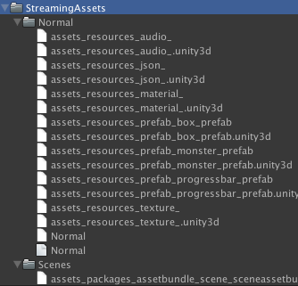|

`一般的AssetBundle包目录：Assets/StreamingAssets/Normal`
`Scene的AssetBundle包目录：Assets/StreamingAssets/Scene`

##### 1.1.4.2.AssetBundle Reference Map File

依赖文件列表文件如下：

`文件名：BundlesMap.asset`
`路径：Resources/Conf`

| 图：1-1-4-2-1 依赖文件列表 | 
|:-------------:|
||

| 选项 | 说明 | 备注 |
| :--- |:-----| :-----|
| ID | BundleID。自动生成。 | - |
| Type | 类型 | 分为：Normal和Scene |
| Path | 路径 | - |
| Targets | 对象列表。| 在上述路径下，根据[1.1.1.Setting File](README.md#111setting-file)中得设定，排除忽略列表中设定的文件，最后成为打包对象的列表一览 |

`该依赖文件，最后将导出成Json文件，跟所有打包成功的AssetBundle文件一同上传到CDN服务上。`

--------------------------------

### 2.Upload
[返回目录](./README.md#contents)

上传CND服务器信息（如：地址，端口号，账号，密码等信息）设定，详情参看：5.2.1.上传服务器设定。

#### 2.0.Upload List

`文件名：UploadList.asset`
`路径：Resources/Conf`

上传列表文件如下：

| 图：2-0-1 上传列表文件| 
|:-------------:|
||

| 项目    | 说明     | 备注 |
|:-------|:---------|:----|
| CheckMode | 检测模式 | 对已经打包的文件进行检测。详情参看：2.0.1 检测模式 |
| BuildTarget | 打包对象 | 保存当前打包的对象临时参数。如（iOS/Android）。在打包是，将自动设置该值，无需手动指定 |
| Compress Format  | 压缩格式 | 预留变量。在AssetBundle打包时采用的压缩格式，以及下载时解压的格式。目前AssetBundle不进行压缩打包。|
| Manifest Upload  | Manifest上传标志位 | 如果制定该标志位，打包后的AssetBundle的各个相关文件的Manifest文件，也将被上传和下载。默认不选中。但是即便不选中，相关的Manifest文件也将在本地被备份。`详情参看：`[2.2.Local BackUp](README.md#22local-backup) |
| BundlesOutputDir | AssetBundle打包输出目录 | `详情参看：`[1.1.4.1.Export Dir](README.md#1141export-dir) |
| Targets | 上传目标列表 | - |

##### 2.0.1.Check Mode

* 检测模式定义
<pre><code>
    // 检测模式.
    public enum TCheckMode {
        // Unity自带模式(hash128).
        Unity3d_Hash128, // 暂时不支持
        // 自定义模式(Md5).
        Custom_Md5,
        // 默认.
        Defult = Custom_Md5
    }
</code></pre>

`目前采用的校验为：自定义模式(Md5)`

1）在AssetBundle再次打包的时候，根据检测模式，来检测当前文件是否与上次上传文件有无变更。无变更，则不上传。
2）在下载后，会对文件进行检测，如果根据检测模式，当前文件检测失败，则将继续要求重新下载。直到下载成功，或者超过最大重新下载数。
`详情参看：`[2.0.2.Target Setting Detail](README.md#202target-setting-detail)

##### 2.0.2.Target Setting Detail

上传对象结构定义

如图：上传对象结构定义

| 图：2-0-2-0 MainManifest |图：2-0-2-1 Normal|图：2-0-2-2 Scene|
|:-------------:|:-------------:|:-------------:|
|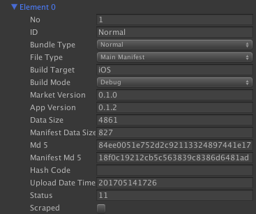|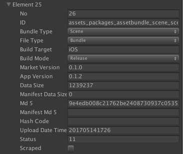||

* MainManifest对象：（如图：2-0-2-0）
* Normal对象：（如图：2-0-2-1）
* Scene对象：（如图：2-0-2-2）

`项目说明`

| 项目名 | 说明 | 备注|
|:------|:----|:----|
| No    | 上传对象No. | 全局唯一，自动采番。下载列生成中，为了保证唯一性，保留此No。 |
| ID    | AssetBundle ID | 打包时自动生成的ID,从打包，上传，下载，加载。至始至终，将被一直保留|
| BundleType | Bundle类型 | 分为一般AssetBundle文件：Normal和场景文件：Scene |
| FileType | 文件类型 | 分为Manifest和Bundle |
| BuildMode | 打包模式 | `详情参看：`[5.0.1.Build Mode Define](README.md#501build-mode-define) |
| MarketVersion | 市场版本号 | 面向不同平台，所采用的版本号 |
| AppVersion | App自己的开发版本号 | 开发&审核用的对外版本号 |
| DataSize | 数据大小 | 打包AssetBundle成功后，所生成的Bundle文件大小 |
| ManifestDataSize | Manifest文件大小 | 同上 |
| Md5 | Md5码 | 打包AssetBundle成功后,所生成Bundle文件的Md5码。在AssetBundle文件打包，校验文件与上次上传是否有所变更，文件下载，校验文件的完整性等时，将会用到此验证码 |
| ManifestMd5 | Manifest文件的Md5码 | 同上 |
| HashCode | HashCode码 | Unity3d 打包AssetBundle后，自动生成校验用的Hash128验证码。目前尚未使用，保留用 |
| UploadDataTime | 上传时间 | 在上传按钮按下同时，会预先，对所有上传对象进行，自动采番。无需手动设定 |
| Scraped | 废弃标志位 | 设定废弃标志位，对象若一经上传到服务器，则不删除服务器上一经存在的文件，但是若尚未上传，则删除本地的文件，不进行备份。在下次下载时，将不会被加入到下载列表。另外要注意的时，如果仅仅是设定了废弃标志位，即便没有文件要上传，上传文件列表(UploadList.json)依然需要上传到服务器 |

#### 2.1.Operation
启动上传准用场景(SceneUpload)
如图：

| 图：2-1-1 上传场景位置| 
|:-------------:|
||


| 图：2-1-2 上传场景| 
|:-------------:|
|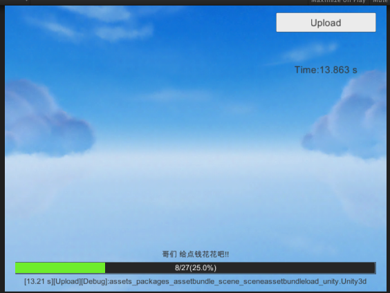|

`目前打包好的资源（详情参看：1.1.4.1.导出目录），要上传到远程CDN服务器，可能需要开启VPN。详情咨询，相关负责人。`

`点击场景中上传按钮，打包资源竟会被自动上传到CDN服务器上。右上角，将显示当前上传所花时间。上传完毕，已经打包的AssetBundle资源将会被备份到本地`

#### 2.2.Local BackUp

`备份目录在本地工程目录`

* 备份目录

	`<工程目录>/BackUp/Bundles/<Platform（如： iOS/Android）>/<上传时间（格式：YYYYMMDDHHMM）>/<资源类型(Normal/Scenes)>`

* 备注：

	`1）上传时间：在点击上传按钮的同时，会自动记录上传时间。精确到分。`

	`2）在上传打包的AssetBundle文件的同时，还有两个文件也是必须上传的。`

	a.上传列表文件（Uploadlist.json）

	-> 文件将以Json文件的格式上传以及备份。该文件保存了至今为止所有的上传文件记录。包括历史记录。下载列表，将由该列表产生。`详情参看：`[3.Download](README.md#3download)。

	b.上传文件依赖列表文件（BundlesMap.json）

	-> 。该文件也是以Json文件格式，上传以及备份。该文件包含了AssetBundle加载中所述，预先加载的所有依赖关系。`详情参看：`[4.AssetBundle Load](README.md#4assetbundle-load)。


如图：

| 图：2-2-1 本地备份目录| 
|:-------------:|
|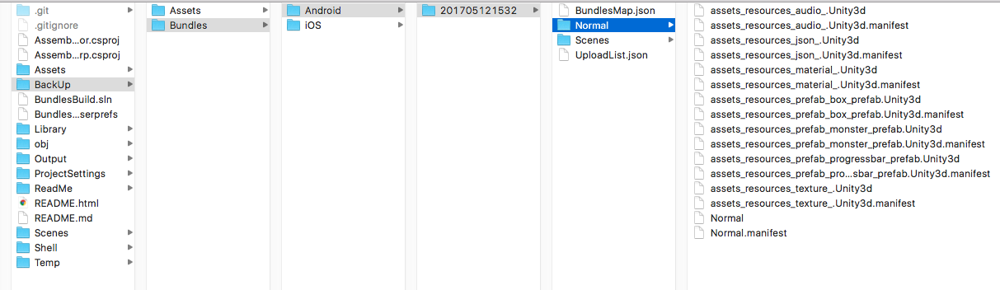|

#### 2.3.Result

上传方式，将以不同的模式上传。针对开发，测试以及向AppStore提交之后，真机测试用。
`打包模式定义详情参看:`[5.0.1.Build Mode Define](README.md#501build-mode-define)

| 图：2-3-1 上传结果| 
|:-------------:|
|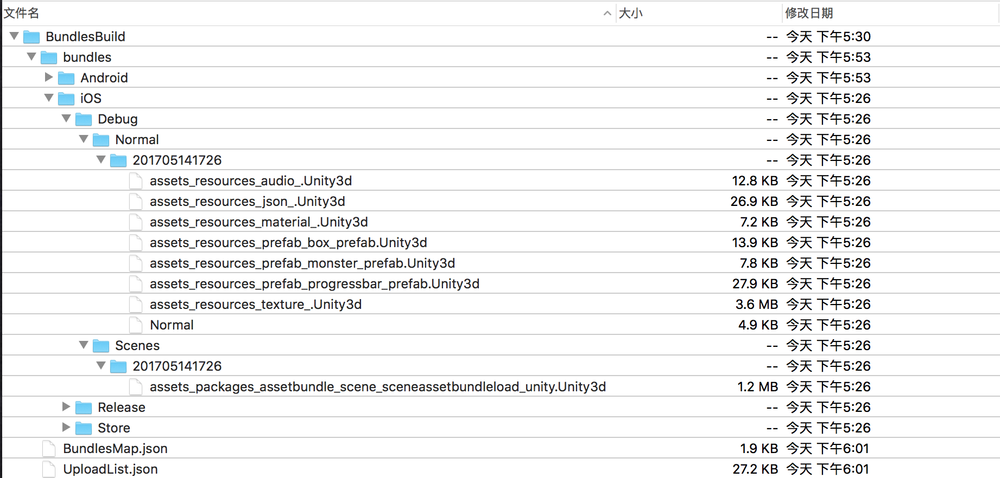|


### 3.Download
[返回目录](./README.md#contents)

`文件名：DownloadList.asset`
`路径：Resources/Conf`

每次启动，会自动从当前下载目录下，导入最新的下载列表。
`详情参看：`[3.2.Download Dir Setting](README.md#32download-dir-setting)

--------------------------------

### 3.0.Download List

下载结构定义：

| 图：3-1-1 下载场景| 
|:-------------:|
|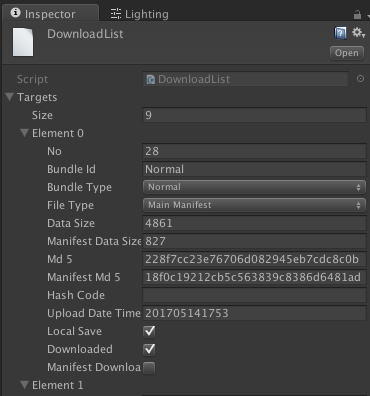|

| 项目名  | 说明 | 备注 |
| :----- | :------- | :-------|
| No | No | 同上传列表No。全局唯一，自动采番 |
| BundleId | ID | 打包AssetBundle时自动产生的ID。与路径相关。 |
| BundleType | AssetBundle类型| 分为：Normal，Scene。|
| FileType | 文件类型 | 分为：Main Manifest和Bundle。|
| DataSize | 数据大小 | 打包AssetBundle成功后，所生成的Bundle文件大小 |
| ManifestDataSize | Manifest文件大小 | 同上 |
| Md5 | Md5码 | 打包AssetBundle成功后,所生成Bundle文件的Md5码。在AssetBundle文件打包，校验文件与上次上传是否有所变更，文件下载，校验文件的完整性等时，将会用到此验证码 |
| ManifestMd5 | Manifest文件的Md5码 | 同上 |
| HashCode | HashCode码 | Unity3d 打包AssetBundle后，自动生成校验用的Hash128验证码。目前尚未使用，保留用 |
| UploadDataTime | 上传时间 | 在上传按钮按下同时，会预先，对所有上传对象进行，自动采番。无需手动设定 |
| LocalSave | 本地保存标志位 | True:在进入游戏前，必须下载保存到本地的。false：无需预先下载，在需要时下载。`目前，只适用true的场合` |
| Downloaded | 下载完成标志位 | - |
| Manifest Downloaded | Manifest文件下载完成标志位。 | 如果：在上传列表中，设置了无需上传Manifest文件标志位了，则这个永远为false。`详情参看：`[2.0.Upload List](README.md#20upload-list) |

### 3.1.Operation

| 图：3-1-1 下载场景| 
|:-------------:|
|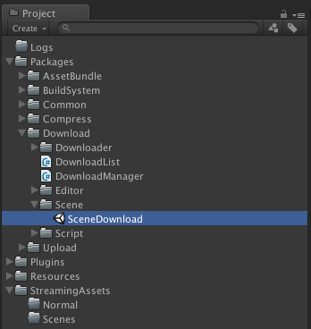|

| 图：3-1-2 下载测试场景 | 
|:-------------:|
|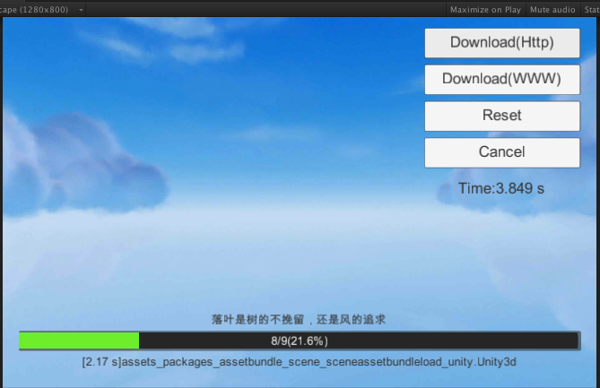|

`点击下载按钮就可以测试相关，就可以开始下载。右上角显示当前下载所花时间。`

`Download（Http）：Http方式下载。支持多线程`

`Download（WWWW）：Unity3d远程WWW方式下载。协同进程下载。`

### 3.2.Download Dir Setting

* 下载根目录
`Application.temporaryCachePath`

* 下载目录

如图：

| 图：3-2-1 下载场景| 
|:-------------:|
|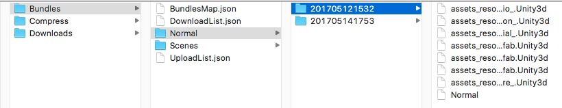|

1) Bundles ： AssetBundle总目录

1.1) Bundles/BundlesMap.json : 所有的打包AssetBundle的关系依赖文件。全局唯一。`详情参看：`[1.1.4.2.AssetBundle Reference Map File](README.md#1142assetbundle-reference-map-file)。

1.2) Bundles/UploadList.json : 上传列表文件。全局唯一。`详情参看：`[2.0.Upload List](README.md#20upload-list)

1.3) Bundles/DownloadList.json : 下载列表文件。全局唯一。新用户首次启动，下载完成将自动生成该文件。`详情参看：`[3.0.Download List](README.md#30download-list)

1.4) Bundles/Normal/<UploadDateTime>/一般的打包AssetBundle文件目录

1.5) Bundles/Scene/<UploadDateTime>/Scene的打包AssetBundle文件目录

2) Compress ： 压缩/加压缩目录

3) Downloads ：下载目录

### 3.3.Download Manager Script
在需要加载的场景中或者对象上挂上脚本，就可以自动进行下载。

如图：

| 图：3-3-1 下载管理脚本挂接 | 
|:-------------:|
|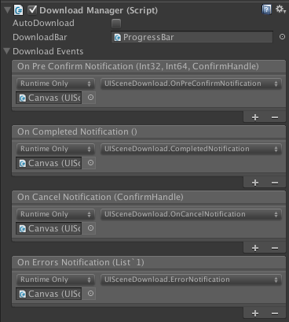|

| 项目名  | 说明 | 备注 |
| :----- | :------- | :-------|
| AutoDownload |  自动下载标志位 | 在没有手动下载按钮的场合，设定该标识为，脚本被加载的同时，将自动开始下载。 |
| DownloadBar | 下载进度条 | 下载的进度信息，将在此时时更新。`详情参看：`[5.3.Progress Bar](README.md#53progress-bar) |
| DownloadEvents | 下载事件列表 | 各个相关事件，在这里指定。|

* 下载事件说明

`下载前消息提示事件（OnPreConfirmNotification）`：在现在开始前，提示用户本次下载有多少文件，下载流量等信息，提示需不需要切换wifi环境等等。

`下载完成事件（OnCompletedNotification）：`：下载完成后，弹出小窗，提示下载完成等等。

`下载取消确认事件(OnCancelNotification)`：下载已经开始，但是中途取消时，提前弹出小窗，提示确认取消下载等等。

`下载错误事件（OnErrorsNotification）`：下载中发生的网络状况，文件损坏等等错误时，返回用户界面提示错误信息等等。

--------------------------------

### 4.AssetBundle Load
[返回目录](./README.md#contents)

#### 4.1.Synchronous Load Interface

详情如下：

| 接口名 | 说明 | 备注 |
|:----- |:-----|:----|
| LoadScene | 同步加载场景 | `场景加载只有同步接口` |
| LoadPrefab | 预制体加载 | - |
| LoadAudio | 音效加载 | - |
| LoadMaterial | 材质加载 | - |
| LoadTexture | 纹理加载 | - |
| LoadAssetFile | （.asset）文件加载 | - |
| LoadTextFile | （.text）文件加载 | - |
| LoadJsonFile | （.json）文件加载 | - |

#### 4.2.Asynchronous Load Interface

详情如下：

| 接口名 | 说明 | 备注 |
|:----- |:-----|:----|
| LoadPrefabAsync | 预制体加载(单个) | - |
| LoadPrefabsAsync | 预制体加载(多个) | - |
| LoadAudioAsync | 音效加载(单个) | - |
| LoadAudiosAsync | 音效加载(多个) | - |
| LoadMatAsync | 材质加载(单个) | - |
| LoadMatsAsync | 材质加载(多个) | - |
| LoadTextureAsync | 纹理加载(单个) | - |
| LoadTexturesAsync | 纹理加载(多个) | - |
| LoadAssetFileAsync | （.asset）文件加载(单个) | - |
| LoadAssetFilesAsync | （.asset）文件加载(多个) | - |
| LoadTextFileAsync | （.text）文件加载(单个) | - |
| LoadTextFilesAsync | （.text）文件加载(多个) | - |
| LoadJsonFileAsync | （.json）文件加载(单个) | - |
| LoadJsonFilesAsync | （.json）文件加载(多个) | - |

#### 4.2.2.Asynchronous CallBack Define

* 定义
`Action<string, TAssetBundleType, UnityEngine.Object> LoadSuccess`

-> 参数定义说明

| 参数名 | 说明 | 备注 |
|:----- |:-----|:----|
| 第一位参数:Key | 根据[4.2.Asynchronous Load Interface](README.md#42asynchronous-load-interface)中各个借口的定义，该参数的实际意义，可能是路径，对象名，文件名等等 | - |
| 第二位参数:加载对象类型 | 根据[4.2.Asynchronous Load Interface](README.md#42asynchronous-load-interface)中所调用接口不同，类型也不同 | - |
| 第三位参数:加载成功后的对象 | 加载出来后，均为UnityEngine.Object.`若有需要，需根据场合自己转换` | - |

#### 4.2.2.1.Load Target Type Define

定义如下：
<pre><code>
    // Asset bundle 类型.
    public enum TAssetBundleType
    {
        // 无.
        None,
        // 场景.
        Scene,
        // 预制体.
        Prefab,
        // 音效.
        Audio,
        // 材质.
        Mat,
        // 纹理.
        Texture,
        // (.asset)文件.
        Asset,
        // (.text)文件.
        Text,
        // (.json)文件.
        Json
    }
</code></pre>

--------------------------------

### 5.Others Setting
[返回目录](./README.md#contents)

#### 5.0.Correlation Type Define
##### 5.0.1.Build Mode Define

* 打包模式定义
<pre><code>
    // BuildMode.    
    public enum TBuildMode {
        // Debug模式.
        Debug,
        // Release模式.
        Release,
        // Store模式.
        Store,
        Max
}
</code></pre>

| 项目 | 说明 | 备注 |
|:----|:----|:----|
| Debug | Debug模式 | 面向开发人员，在开发阶段使用模式。 |
| Release | Release模式 | 面向测试人员或者线上版本技能确认用等|
| Store | Store模式 | 面向用户，原则上一经上传，禁止删除，以及对以后文件进行修改，修复只能上传新的文件到服务器来替换|


#### 5.1.Build Info Setting

文件设定如下：

`文件名：BuildInfo.asset`
`路径：Resources/Conf`

| 图：5-1-1 下载管理脚本挂接 | 
|:-------------:|
|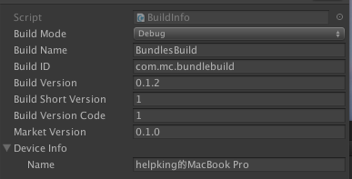|

`此文件设定了各个打包成ipa/apk文件时所需要的信息。打包之前，会自动往各个设置文件中进行相关设定。如Android的场合的花，会自动的设定Manifest的XML文件，iOS的场合的话，会设置导出的XCode工程中得相关信息后，在打包成ipa文件`

#### 5.2.Server Config
文件设定如下：

`文件名：ServerConf.asset`
`路径：Resources/Conf`

| 图：5-2-1 服务器相关设定 | 
|:-------------:|
|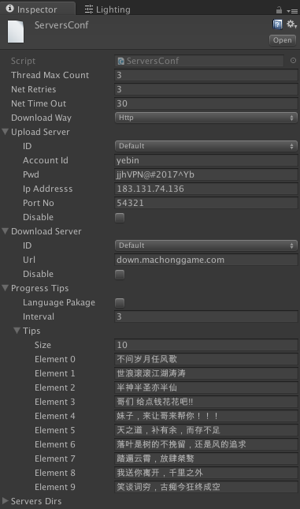|

| 项目 | 说明 | 备注 |
|:----|:----|:----|
| ThreadMaxCount | 线程最大数 | 上传和下载中，若采用线程方式，则此为同时最大允许启动的线程数上限。|
| NetRetries | 网络重试数 | 当网路通信不通，错误以及其他原因产生的故障是，不管是上传还是下载，都会重试重发请求。这是重发请求数上限。|
| NetTimeOut | 网络超时 | 单位：秒 |
| DownloadWay | 下载方式 | 方式有：http，wwww（Unity3d原生）|
| UploadSever | 上传服务器信息 | 包括账号，密码，地址，端口号等等 |
| DownloadSever | 下载服务器信息 | - |

#### 5.2.1.Progress Tips
`进度条上方，随着下载或者上传进度不通，周期性的变化提示信息。（如魔兽世界的加载中，会有些游戏趣味小提示。）`

| 项目 | 说明 | 备注 |
|:----|:----|:----|
| Language Pakage | 语言包标志位 | `保留项目：`将来考虑到语言包扩充问题，暂时预留该标志位 |
| Inerval | Tips更新时间间隔 | 单位：秒 |
| Tips | 趣味小提示列表 | - |

#### 5.3.Progress Bar

#### 5.3.1.Create UI

选中要挂接的对象，在Hierarchy窗口，右键创建如下图操作，进图条就会自动创建。

| 图：5-3-1 创建进度条 | 
|:-------------:|
|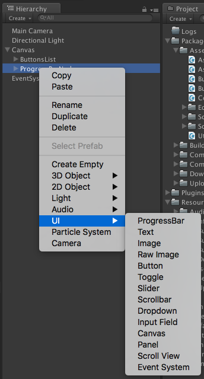|

--------------------------------

## 6.Build
[返回目录](./README.md#contents)

`Build详情参看：`[Android Build](Build.md#contents)

--------------------------------

### 6.1.Android Build
[返回目录](./README.md#contents)

`Android Build详情参看：`[Android Build](Build.md#2android-build)

--------------------------------

### 6.2.iOS Build
[返回目录](./README.md#contents)

`iOS Build详情参看：`[iOS Build](Build.md#3ios-build)

--------------------------------
### 8.IAP
[返回目录](./README.md#contents)

`IAP详情参看：`[IAP](IAP.md#contents)

--------------------------------

### 9.FAQ
[返回目录](./README.md#contents)

--------------------------------

### 10.Remaining Problems
[返回目录](./README.md#contents)

* 1) 上传文件（UploadList.json）文件大小问题

	按目前统计：平均每条更新记录占504 byte。如果按最大5000条记录来计算，这个文件大小有可能超过2520740 byte。也就是2.4MB这个貌似还是略大。

* 2）进度条更新有锁死现象（偶尔）

-> 原因：

	可能是协同进程配合lock有锁住主进程的可能

-> 对策：

	进度条更新，另起一个线程，让这个线程自己带更新锁，来防止多线程同时更新