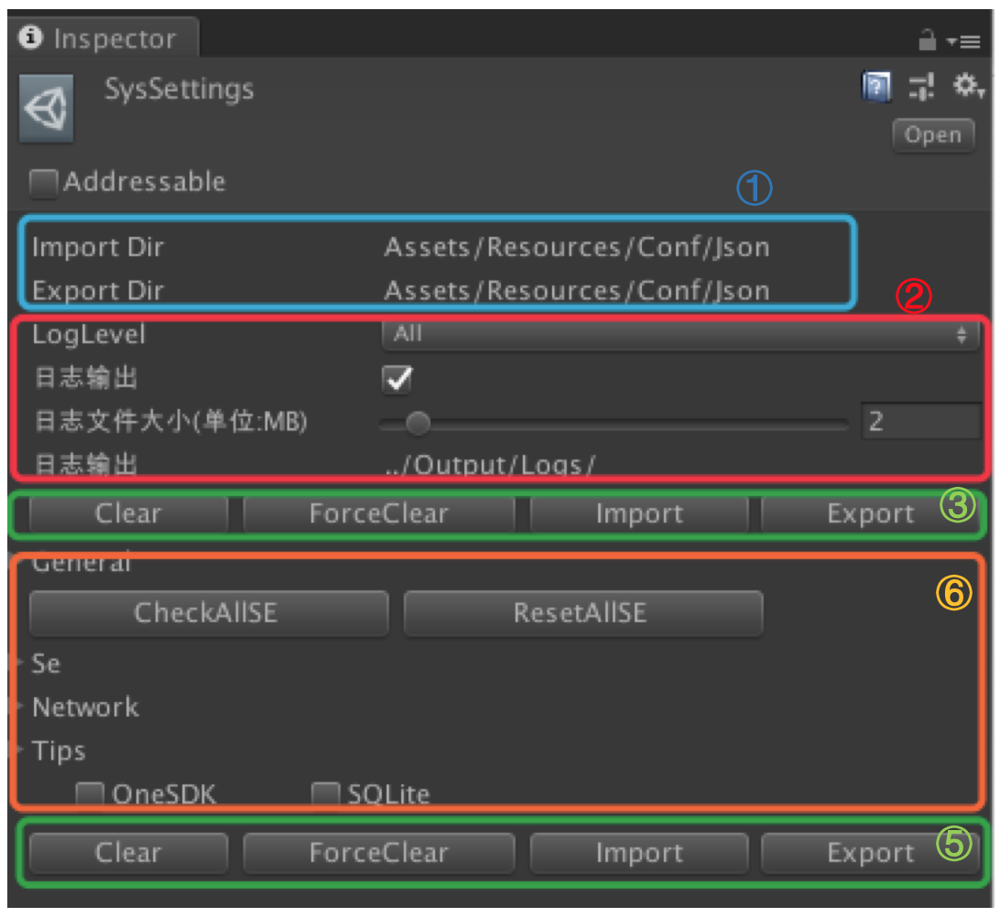
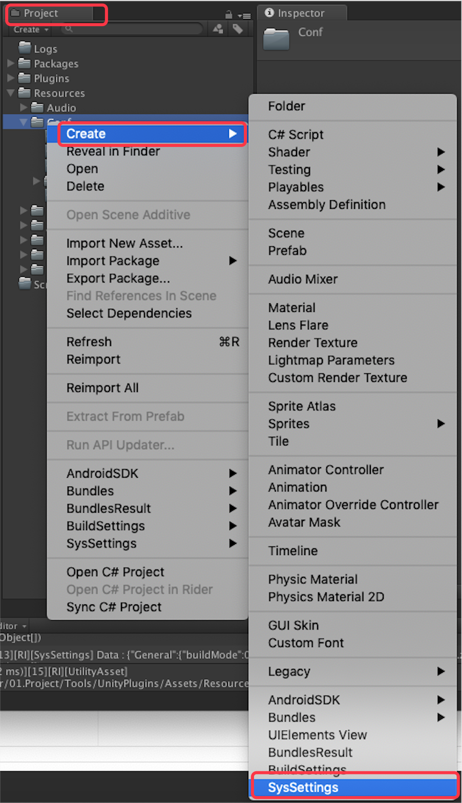
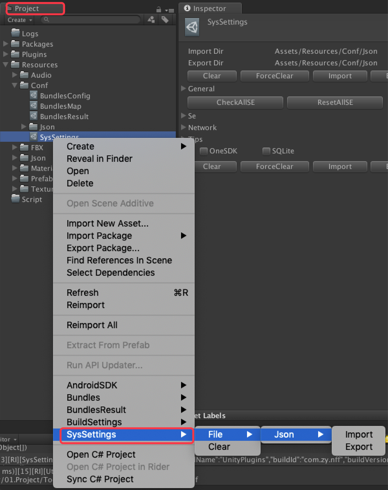
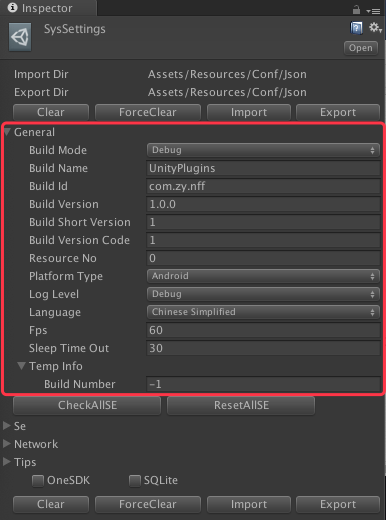
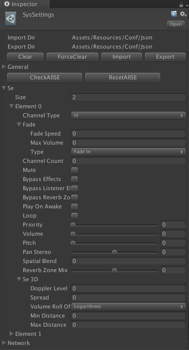
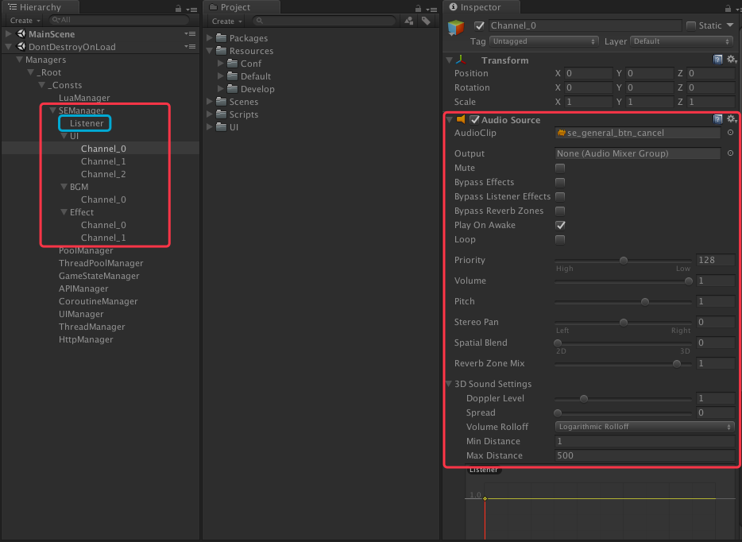
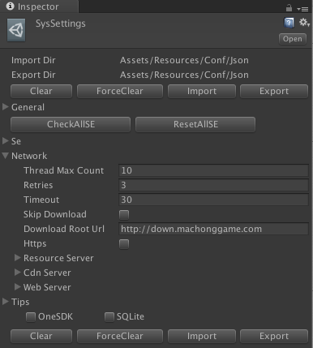
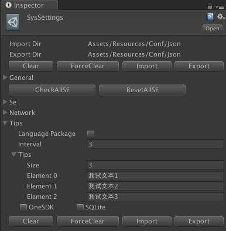
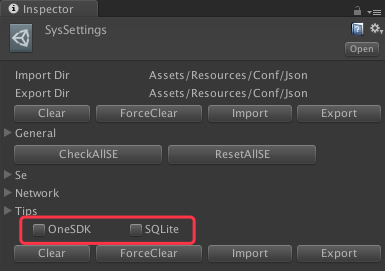

# 目录
[返回主目录](./README.md#2%E7%B3%BB%E7%BB%9F%E8%AE%BE%E5%AE%9A)

--------------------------------

#### [2.系统设定](./SysSettings.md#2%E7%B3%BB%E7%BB%9F%E8%AE%BE%E5%AE%9A-1)

##### [2.1.菜单操作](./SysSettings.md#21%E8%8F%9C%E5%8D%95%E6%93%8D%E4%BD%9C-1)

##### [2.2.编辑器扩展](./SysSettings.md#22%E7%BC%96%E8%BE%91%E5%99%A8%E6%89%A9%E5%B1%95-1)

###### [2.2.1.顶部/底部Bar](./SysSettings.md#221%E9%A1%B6%E9%83%A8%E5%BA%95%E9%83%A8bar-1)

###### [2.2.2.一般](./SysSettings.md#222%E4%B8%80%E8%88%AC-1)

###### [2.2.3.音效频道](./SysSettings.md#223%E9%9F%B3%E6%95%88%E9%A2%91%E9%81%93-1)

###### [2.2.4.网络](./SysSettings.md#224%E7%BD%91%E7%BB%9C-1)

###### [2.2.5.Tips](./SysSettings.md#225tips-1)

###### [2.2.6.选项](./SysSettings.md#226%E9%80%89%E9%A1%B9-1)

--------------------------------

## 2.系统设定
[返回目录](./SysSettings.md#%E7%9B%AE%E5%BD%95)

App系统级别的相关设定。主要包含，一般/临时信息，音效设定，网络设定等消息。

在`Inspector`面板中显示如`图2-1`：

| `图 2-1` 面板显示 |
| :-----: |
||

| 项目 | 说明 | 备注 |
|:---: |:----|:----|
| ① | 导入/导出路径 | 系统设定信息的导入导出目录。导入/导出数据为Json格式。 |
| ② | 日志输出相关设定 | * Loglevel : 日志等级  * 日志输出 : 是否将日志输出到日志文件标识位。  * 日志文件大小 : 单个日志文件输出上限.单位:`MB`。超过该上限会自动新建文件。  * 日志输出 : 当前日志输出目录。`依赖与当前工程目录`。  `注意` :  日志相关设定，不作为系统设定信息内容，只作为本地信息管理。 | 
| ③ | 顶部按钮Bar | 包含：清空/强制清空/导入/导出 | 
| ④ | 系统设定的详细信息 | * General : 一般信息。  * Se : 音效设定   * Network : 网络设定　  * Tips : 提示信息  |
| ⑤ | 底部按钮Bar | 同③ |

### 2.1.菜单操作
[返回目录](./SysSettings.md#%E7%9B%AE%E5%BD%95)

系统设定的相关才做也可以在`Project`中来创建该设定文件，也可以清空/导入/导出等动作。

`创建`

> `Create` -> `SysSettings`

如`图2-1-1`

| `图2-1-1` 菜单创建 |
| :-----: |
||

该文件会固定生成在以下目录

> Assets/Resources/Conf

数据文件(Json数据)导出默认路径为：

> Assets/Resources/Conf/Json

`选项`

> // 导入。功能与`Inspector`面板按钮功能相同
> 
> `SysSettings` -> `File` -> `Json` -> `Import` 
> 
> // 导出。功能与`Inspector`面板按钮功能相同
> 
> `SysSettings` -> `File` -> `Json` -> `Export`
> 
> // 清空。功能与`Inspector`面板按钮功能相同
> 
> `SysSettings` -> `Clear`

如`图2-1-2`

| `图2-1-2` 菜单选项 |
| :-----: |
||

### 2.2.编辑器扩展
[返回目录](./SysSettings.md#%E7%9B%AE%E5%BD%95)

编辑器扩展后，在`Inspector`面板显示如`图2-1-1`。

具体的接口详细可以参看：[1.2.共通](./General.md#12%E5%85%B1%E9%80%9A-1)中的`DataBase`，`AssetBase`和`EditorBase`。

#### 2.2.1.顶部/底部Bar
[返回目录](./SysSettings.md#%E7%9B%AE%E5%BD%95)

在`Inspector`面板中会出现顶部/底部Bar。如`图2-1-1`。 为对该文件提供相应的一些快捷操作方式。

`注意`：ForceClear不仅仅是清空当前对象的设定信息，也会把相应导入目录下对应的数据文件删除。

#### 2.2.2.一般
[返回目录](./SysSettings.md#%E7%9B%AE%E5%BD%95)

一般设定信息设定如`图2-2-2-1`。

| `图2-2-2-1` 一般设定 |
| :-----: |
||

| 项目 | 说明 | 命令行 | 备注 |
|:--- |:----|:----|:----|
| BuildDebug | 打包模式 | `CMD` -debug/-release/-production | 目前支持格式如下：  * Debug(`默认`)   * Release   * Production |
| BuildName | 打包名 | `CMD` -gameName [名称] | 该名字就是在游戏在安装成功后，在手机中显示的名字。  `优先级低于命令行指定`。  命令行设定参看[3.1.命令行参数](./BuildSystem.md#31%E5%91%BD%E4%BB%A4%E8%A1%8C%E5%8F%82%E6%95%B0-1) |
| BuildId | 打包ID | `CMD` -buildId [ID] | 该ID为Android/iOS下的App的统一标识符。  BuildId : Android下为`AndroidManifest.xml`下跟节点属性`package`/ iOS下XCode->General面板中的:`Bundle identifier` 该标识符在App中还有许多其他功用。  |
| BuildVersion | 打包版本 | `CMD` -buildVersion [版本号] | 标本标识方法由各个项目自定义。 如：1.0.0 |
| BuildShortVersion | 打包版本（短号） | - | 该版本短号，是在小规模修正，比如：单个或者少数的几个小BUG修正，显示类的修正等等 |
| BuildVersionCode | 打包码 | `CMD` -buildVersionCode [版本号] | 该打包码是从项目发布开始，从1开始标号的统一连续数字采番。 一般为`内部统一标识别号`。 |
| ResourceNo | 资源号 | `CMD` -buildNo [No] | 资源号/版本号。  该号由CI工具打包自动采番。 如：TeamCity/Jenkin下，就是打包流水线的No |
| PlatformType | 平台类型 | `CMD` -Huawei/-Tiange | 平台类型：  * None:未指定。该情况下，会根据实际情况切换为`Android`或`iOS`  * iOS:iOS  * Android  * Huawei:华为  * Tiange:复合模式(本身不是平台，用的是易接SDK。但是因为`业务需要`，单独定义了这么一个平台类型。) |
| LogLevel | Log等级 | `CMD` -logLevel [Log等级] | Log等级。 按照Log等级的大小，会相应`过滤掉低于当前Log等级`的Log输出。  * Invalid(无效) : -1  * All : 0  * Debug : 1   * RInfo : 2   * Warning : 3 <--- `推荐默认`   * LInfo : 4   * Error : 5   * Fatal : 6  * Off : 6  |
| Language | 语言指定 | -(可扩展) | - |
| FPS | fps | - | - |
| SleepTimeOut | 待机超时 | - | 单位：秒 |
| TempInfo:BuildNumber | 临时信息：打包No | `CMD` -buildNo [No] | 临时存储了打包No。若是本地打包，则为-1   该No与导出后的Apk/Ipa的文件名关联。  详细参看:[3.1.1.Apk/Ipa导出文件命名](./BuildSystem.md#311apkipa%E5%AF%BC%E5%87%BA%E6%96%87%E4%BB%B6%E5%91%BD%E5%90%8D-1) | 

`CMD`为命令行命令。示例参考:[3.1.命令行参数](./BuildSystem.md#31%E5%91%BD%E4%BB%A4%E8%A1%8C%E5%8F%82%E6%95%B0-1)

#### 2.2.3.音效频道
[返回目录](./SysSettings.md#%E7%9B%AE%E5%BD%95)

该设定`只针对公共频道`的音频(SE+BGM)设定。并依赖于SE管理器。`SE管理器`将在后续版本支持。

可以手动追加以下几种音效频道：

* UI : UI音效频道
* Effect : 特效音效频道
* BGM : 背景音效频道

`音效频道设定`

| `图2-2-3-1` 音效频道设定 |
| :-----: |
||

> 音效频道以下简称`音道`

| 项目 | 说明 | 备注 |
|:--- |:----|:----|
| ChannelType | 频道类型 | 频道分为:  * UI音效频道  * 特效音效频道  * 背景音效频道 |
| Fade | 渐入/渐出设定 | - |
| - | FadeSpeed | 渐入/渐出速度 |
| - | MaxVolume | 最大音量(`0.0f ~ 1.0f`) |
| - | Type | 渐入/渐出类型。 None : 无。一般音道（无渐入/渐出效果）。 FadeIn : 渐入音道。 FadeOut : 渐出音道。 |
| ChannelCount | 音道数 | SE管理器会在App启动时，同时生成的该音道的数量。 生成的频道数可以参看：`图2-2-3-2` 音效频道示例 |
| Mute | 静音 | Mute是设置音量为0，取消静音是恢复原来的音量 |
| BypassEffects | 音源滤波开关 | 是那些作用在当前音源的音频滤波器的开关。  滤波器包括   * `高通滤波`  * `低通滤波`  * `回波滤波`  * `扭曲滤波`  * `回音滤波`  * `和声滤波`等。  这些滤波器可以设置在音源或者监听器上，勾选此项时，将使那些设置在音源的滤波器失效。 |
| BypassReverbZones | 监听器滤波开关 | 是那些作用在当前监听器的音频滤波器的开关。 `同上`，勾选此项时，将使那些设置在监听器的滤波器失效。 | - |
| BypassReverbZones | 回音混淆开关 | 当勾选时，不执行回音混淆，即便现在玩家位于回音区域， 此音源也不会产生回音。回音效果取决于监听器位置 （一般代表玩家位置）与回音区域位置关系，而与音源没有直接关联。|
| PlayOnAwake | 启动播放开关 | 如果勾选的话，那么当GameObject加载并启用时，立刻播放音频， 即相当于此音源GameObject的组件中Awake方法作用时开始播放。 如果不勾选的话，需要手动调用Play()方法执行播放。|
| Loop | 循环播放开关 | - |
| Priority | 播放优先级(`Hight`:0 ~ `Low`:256) | 决定了当前音源在当前场景存在的所有音源中的播放优先级。 (优先级: 0 = 最重要. 256 = 最不重要. 默认值 = 128.). 背景音乐最好使用0，避免它们有时被其它音源替换出去。 一般手机或者其它播放设备最多允许32个音源同时播放， 这个优先级参数决定了在超出音源数目时，需要暂时关闭一些不重要的音源， 优先播放更重要的音源 |
| Volume | 音源音量 | 此音量代表了监听器处于`距离音源1米`时的音量大小，代表了最大音量处的声音大小。 |
| Pitch | 音频音调(-3.0f ~ +3.0f) | 代表了播放音频时速度的变化量，默认值是1，代表了正常的播放速度。  当<1时，慢速播放。 当>1时，快速播放，速度越快，则音调越高 |
| PanStereo | 声道占比(`Left`:-1.0f ~ `Right`:+1.0f) | 此数值在[-1,1]之间变化，代表了2D音源的左右声道占比， 默认值为0，代表左右声道输出同样音量大小。 此数值针对2D音源或者2D、3D混合音源有效，纯3D音源无效 |
| SpatialBlend | 空间混合(`2D`:0.0f ~ `3D`:1.0f) | 此数值在[0,1]之间变化，指定当前音源是2D音源、3D音源，还是二者插值的复合音源。 此参数决定了引擎作用在此音源上的3D效果的份量。 主要影响“3D Sound Settings”属性组中的参数表现。 比如，如果是2D音源，声音在距离上不衰减，也就没有多普勒效果。 无论2D、3D，与音频滤波器不关联。 例如即便是纯2D音源，它仍然响应回音区域，而滤波器的控制主要由相应的滤波参数和音源滤波混合参数决定， 混合参数如前面讲到的Bypass Effects、Bypass Listner Effects两个开关以及后面讲到的Reverb Zone Mix。 也就是说，此参数与“3D Sound Settings”属性组中的3D音频设置参数共同作用构成最终的输出， 而当纯2D音源时，3D音频设置将无视，纯3D音源时，3D音频设置得到完整输出，非纯情况则插值混合输出。 |
| ReverbZoneMix | 回音混合(0.0f ~ 1.0f) | 设置输出到混响区域中的信号量。 一般在[0,1]范围内变化, 不过也允许额外最多放大10分贝(1 - 1.1]来增强声音的远近效果。 也就是说，回响效果的回响距离等很多复杂参数主要由回响滤波器实现， 而回响音量大小主要由此因子来简单控制。 |
| Se3D | 3D设置 | - |
| - | DopplerLevel | 多普勒等级(0.0f ~ 5.0f) 在[0,5]之间变化，默认值为1。 决定了音源的多普勒效应的份量，如果设置为0，则没有多普勒效应。 多普勒效应指的是当监听器与音源之间发生相对运动时，声音传递速度发生变化时的效果。 假设有一架飞机掠过上空，飞机上的警报器每个一秒钟发出一次声音， 如果相对静止，则听到的效果是完整的每个一秒一次警报(尽管发出到听到需要较长的时间，但是间隔应该是一样的)， 而当飞机向我快速靠近时，由于距离在不断缩短，从发声到听到的距离在不断缩小， 因此传递所化的时间越来越少，我方听到的警报应该是越来越紧促， 而非均匀的每秒一次，靠近速度越快，警报间隔越短。当飞机快速离去时， 则情况恰好相反，警报声音节奏越来越松缓。 |
| - | Spread | 传播角度(0 ~360度)  设置扬声器空间的立体声传播角度。默认值为0。 好像稍稍影响了回音效果，其它暂时没看出太大的影响，如果读者有更详细解释请告知。 |
| - | rollOff | 音源衰减模式。默认：Logarithmic。 代表了声音在距离上的衰减速度， (具体衰减数值由曲线决定，X-距离，Y-衰减后剩余百分比)   * Logarithmic ： 预制的对数衰减曲线，`可以修改`。  * Linear ： 预制的线性衰减曲线，`可以修改`。  * Custom ： 自定义的衰减曲线，完全手动设置。|
| - | MinDistance | 最小距离。 默认值为1米，代表了音量曲线中的最大音量位置。 超越最小距离时，声音将逐渐衰减。 如果增大最小距离，则将相当于增大了3D世界中的声音，因为最小距离以下的位置均获得最大音量。 如果减小最小距离，则相当于减小了3D世界中声音。 因为由Volume参数可知，在曲线上1米处为最大音量，默认曲线<1米处均获得最大音量， 而当MinDistance<1时，默认曲线中X=1处的音量响应也会变小。 注意上图中Listener竖线代表了监听器与当前音源的相对距离， 而与Volume曲线的交点即是：1米处的最大音量经过3D世界距离传播到当前位置而衰减后的音量大小， 即如果在曲线上，1米处Y坐标是0.8，而Listener处Y坐标是0.4， 那么最终音量是衰减了50%，此参数与Volume参数共同作用输出最终音量大小，也即Volume*0.5 |
| - | MaxDistance | 最大距离。 当超出此距离时，声音将停止衰减。 注意这里是停止衰减，也就是说，后续更远处听到的声音将保持在最大距离点的声音大小，不代表声音为0 |

`注意`:

* 上述设定与Unity3d的组件`Audio Source`的属性，基本上是一一对应的。该设定用于App启动时，对全局的`音道`做预设定。详细如`图2-2-3-2` 音效频道示例。
* 上述设定需要依赖与音频管理器脚本。详情参看:[音频管理器(未)]()

| `图2-2-3-2` 音效频道示例 |
| :-----: |
||

#### 2.2.4.网络
[返回目录](./SysSettings.md#%E7%9B%AE%E5%BD%95)

网络设定详细如`图2-2-4-1`

| `图2-2-4-1` 网络设定 |
| :-----: |
||

| 项目 | 说明 | 备注 |
|:--- |:----|:----|
| ThreadMaxCount | 通信用的线程上限数 | 线程相关设定需要依赖于线程管理器。 详情参看:[线程管理器(未)]() |
| Retries | 重试次数 | 每当因为网络繁忙，线路故障，路有问题等造成的通信问题，而自动再次重发请求的次数。 |
| Timeout | 通信超时 | 单位：秒 |
| SkipDownload | 跳过下载标识位 | 该设置只在开发模式下，且不需要更新AB包等热更资源的情况下，`有意义`。  该参数可由外部，经由外部参数指定。详情参看:[3.1.命令行参数](./BuildSystem.md#31%E5%91%BD%E4%BB%A4%E8%A1%8C%E5%8F%82%E6%95%B0-1) |
| DownloadRootUrl | 下载根地址 | 资源下载或热更时，下载的根地址。  目前尚未完全匹配工程逻辑，需要项目自己组装该地址。 |
| Https | Https协议标识位 | 如果勾选该选项，在Http通信时，会采用Https协议。 |
| ResourceServer | 资源服务器设定 | AB包打包成功后，会同步生成向资源服务器自动上传的`Shell`脚本。  `仅在编辑器模式下有效。一般打包/运行模式下，该信息将不回包含进Apk/Ipa文件中。`  详细会在下面具体说明。 |
| CdnServer | CDN服务器设定 | AB包打包成功或Apk/Ipa成功打包后，除了会自动生成自动上传的`Shell`脚本外，还会生成自动刷新CDN服务器的`Shell`脚本。  `仅在编辑器模式下有效。一般打包/运行模式下，该信息将不回包含进Apk/Ipa文件中。`  详细会在下面具体说明。 |
| WebServer | 前端Web服务器 | 该地址与拉取`游戏服务器列表`,`游戏公告`,`游戏推送`等功能关联。  详细会在下面具体说明。 |

#### 2.2.5.Tips
[返回目录](./SysSettings.md#%E7%9B%AE%E5%BD%95)

此处的设置可用于持续时间较长的`场景加载进度条`，`资源下载进度条`时，在进度条附近，动态刷新的提示用的信息。

详细如`图2-2-5-1`

| `图2-2-5-1` Tips |
| :-----: |
||

| 项目 | 说明 | 备注 |
|:--- |:----|:----|
| Language Package | 语言包标识位 | 勾选该标识位需要依赖与本地化语言包。  详情参看:[本地化语言包(为)]() |
| Interval | 刷新时间间隔 | 单位:秒 |
| Tips | 提示信息列表 | `注意`：  若`Language Package`勾选，则此处需要设置相关的语言文本ID。 |

#### 2.2.6.选项
[返回目录](./SysSettings.md#%E7%9B%AE%E5%BD%95)

选项设定具体如`图2-2-6-1`

| `图2-2-6-1` 选项 |
| :-----: |
||

| 项目 | 说明 | 备注 |
|:--- |:----|:----|
| OneSDK | 易接SDK | 勾选的话，在Android打包时，会接入易接SDK  详细可以参看:[3.4.Apk打包](./BuildSystem.md#34apk%E6%89%93%E5%8C%85-1) |
| SQLite | SQLite | 勾选的话，在本地会导入轻量数据库SQLite  详细可以参看:[本地数据库(未)]() |